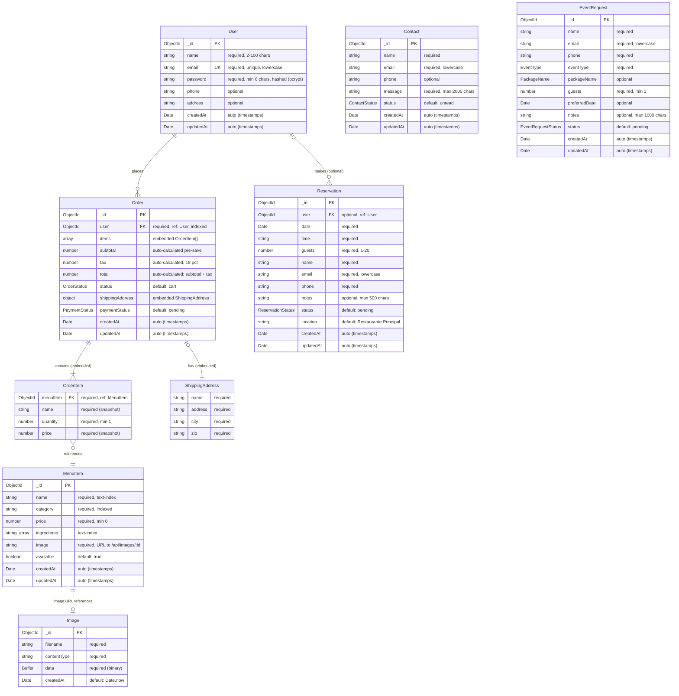

# Database Schema — Restaurant01

> Diagrama Entidad-Relación generado a partir de los modelos Mongoose en `backend/src/models/`.
> Sintaxis: [Mermaid ER Diagram](https://mermaid.js.org/syntax/entityRelationshipDiagram.html)

---

## Diagrama ER

---

## Enums / Tipos enumerados

| Enum | Valores |
|---|---|
| **OrderStatus** | `cart`, `pending`, `confirmed`, `preparing`, `ready`, `delivered`, `cancelled` |
| **PaymentStatus** | `pending`, `paid`, `refunded` |
| **ReservationStatus** | `pending`, `confirmed`, `cancelled`, `completed` |
| **ContactStatus** | `unread`, `read`, `responded` |
| **EventRequestStatus** | `pending`, `contacted`, `confirmed`, `cancelled` |
| **EventType** | `social`, `corporativo`, `privado`, `otro` |
| **PackageName** | `Esencial`, `Premium`, `Elite` |

---

## Índices

| Colección | Campo(s) | Tipo |
|---|---|---|
| **User** | `email` | unique |
| **MenuItem** | `category` | standard |
| **MenuItem** | `name`, `ingredients` | text (full-text search) |
| **Order** | `user` | standard |
| **Reservation** | `user`, `date` | compound (user ↑, date ↓) |
| **Reservation** | `date`, `time` | compound |

---

## Notas

- **OrderItem** y **ShippingAddress** son _subdocumentos embebidos_ dentro de `Order` (no tienen `_id` propio, `_id: false`).
- **Order** calcula `subtotal`, `tax` (18%) y `total` automáticamente en un hook `pre('save')`.
- **User.password** se hashea con `bcrypt` en `pre('save')` y tiene `select: false` (no se incluye en queries por defecto).
- **Reservation.user** es **opcional** — permite reservaciones sin cuenta de usuario.
- **MenuItem.image** almacena una URL string que apunta al endpoint `/api/images/:id`, creando una relación implícita con la colección `Image`.
- **Contact** y **EventRequest** son entidades independientes sin relaciones FK (formularios públicos).
