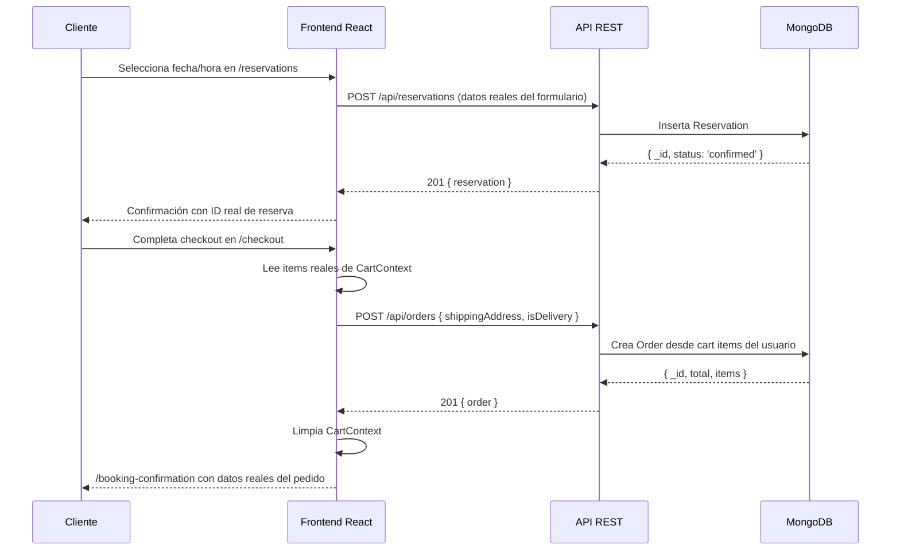
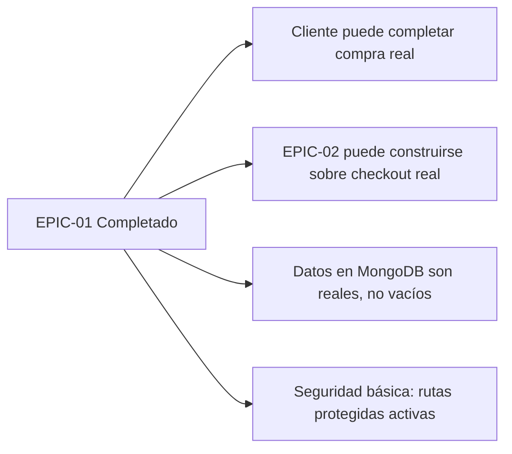

# EPIC-01 — Completar MVP Core (Integración Real del Frontend)

> La infraestructura de backend para el ciclo básico del cliente —reservar, pedir, ver perfil, gestionar su historial— está completa al ~90%. Sin embargo, el frontend tiene 4 páginas críticas que operan con datos ficticios o simulaciones con `setTimeout`. Este epic elimina todos los mocks y conecta cada página con su API correspondiente real.

## Contexto de Negocio

> El restaurante **no puede operar digitalmente** hasta que el flujo completo menú → carrito → checkout → confirmación esté conectado de extremo a extremo. Actualmente un cliente puede agregar ítems al carrito, pero al llegar a Checkout, sus datos son "Juan Pérez" y el pago es un `setTimeout` de 2 segundos. Esto hace que el MVP sea estructuralmente no funcional para producción. Todo el código de backend necesario **ya existe** — este epic es de integración, no de construcción nueva.

## Descripción

**Como** operador del restaurante,
**quiero** que todo el flujo digital del cliente esté integrado con el backend real,
**para** poder recibir reservas y pedidos reales desde el día de lanzamiento.

---

## Features Incluidas

| Feature | Descripción | Esfuerzo Est. |
|---|---|---|
| [FEAT-01](../features/FEAT-01_Conectar_Reservaciones.md) | Conectar formulario de Reservaciones al API real | Baja |
| [FEAT-02](../features/FEAT-02_Conectar_Checkout.md) | Conectar Checkout al API real + leer CarritoContext | Media |
| [FEAT-03](../features/FEAT-03_Perfil_y_Mis_Pedidos.md) | Perfil dinámico desde AuthContext + nueva página Mis Pedidos | Media |
| [FEAT-04](../features/FEAT-04_Guards_Rutas_Privadas.md) | PrivateRoute + migración carrito anónimo → autenticado | Media |

---

## Flujo de Valor End-to-End

---

## Dependencias

| Dependencia | Tipo | Estado |
|---|---|---|
| `POST /api/reservations` | Backend | ✅ Ya existe y funciona |
| `GET /api/reservations/my` | Backend | ✅ Ya existe y funciona |
| `POST /api/orders` | Backend | ✅ Ya existe y funciona |
| `GET /api/orders` | Backend | ✅ Ya existe y funciona |
| `GET/PUT /api/users/profile` | Backend | ✅ Ya existe y funciona |
| `src/services/api.ts` | Frontend | ✅ Todos los métodos ya escritos |
| EPIC-02 (Pasarela de Pago) | Épica | Depende de FEAT-02 completado |

---

## Criterios de Éxito de la Épica

- [ ] `0` páginas con datos hardcodeados en producción ("Juan Pérez", arrays estáticos)
- [ ] `0` instancias de `setTimeout` simulando llamadas a API
- [ ] Rutas `/profile`, `/checkout`, `/my-reservations` redirigen a `/login` si el usuario no está autenticado
- [ ] Al hacer login, el carrito anónimo de `localStorage` se fusiona automáticamente con el carrito del servidor
- [ ] `BookingConfirmation` muestra datos reales del pedido/reserva (nombre, fecha, total, número de referencia)
- [ ] Nueva página `/my-orders` lista el historial real de pedidos del usuario autenticado

---

## Impacto en el Sistema

