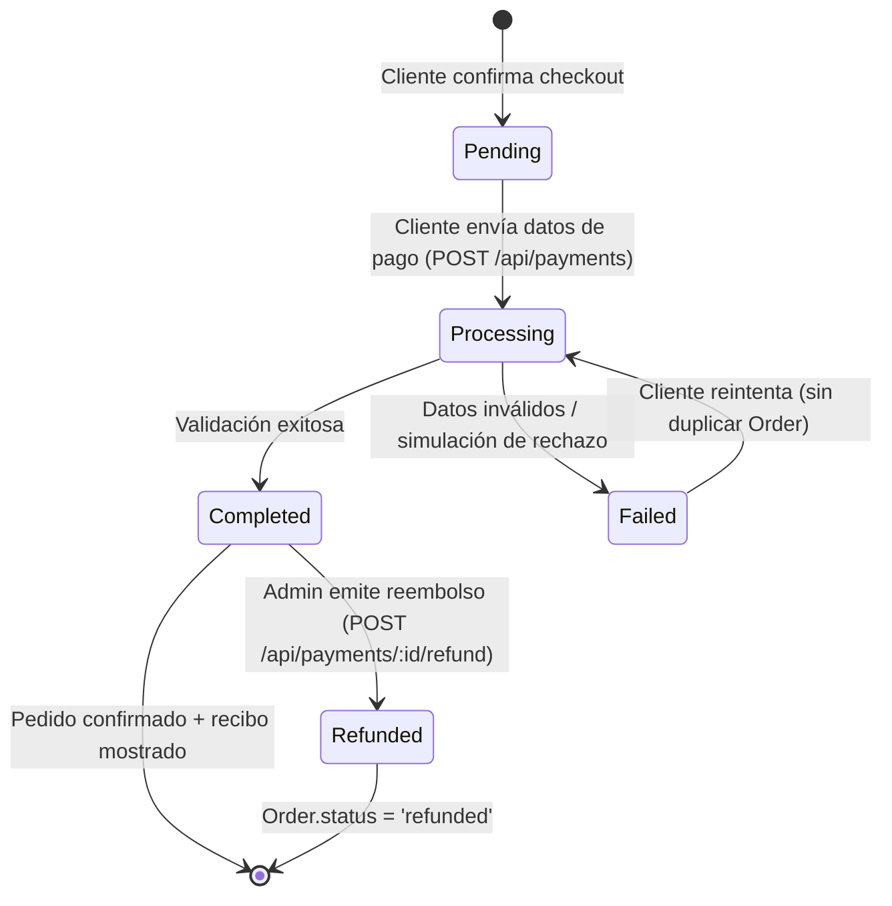
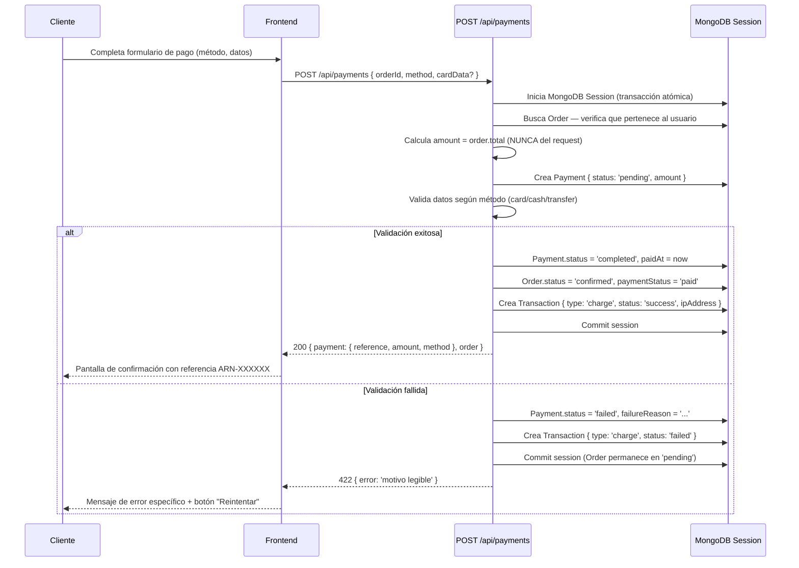

# EPIC-02 — Pasarela de Pago Propia (BD-Based)

> El restaurante ha tomado la decisión estratégica de procesar pagos a través de su propia base de datos, sin depender de procesadores externos (Stripe, PayPal, Mercado Pago). Esto implica construir desde cero el motor de pagos, los modelos de datos, los endpoints de la API, y la UI de checkout con pago real integrado.

## Contexto de Negocio

> "Un restaurante que no cobra no es un restaurante — es una cocina de práctica." Esta épica hace que Arancia pueda monetizarse realmente. Al no usar procesadores externos, el restaurante evita comisiones por transacción y mantiene control total de los datos financieros. La contrapartida es implementar correctamente la seguridad y confiabilidad que un procesador externo normalmente provee.
>
> **Métodos de pago soportados:**
> - **Efectivo** (pago en entrega o en sitio)
> - **Tarjeta** (datos de tarjeta gestionados internamente con hash; solo últimos 4 dígitos en BD)
> - **Transferencia bancaria** (referencia de confirmación)

## Descripción

**Como** propietario del restaurante,
**quiero** un sistema de pago propio que registre cada transacción en nuestra base de datos,
**para** tener control total de los datos financieros sin pagar comisiones a terceros.

---

## Features Incluidas

| Feature | Descripción | Esfuerzo Est. |
|---|---|---|
| [FEAT-05](../features/FEAT-05_Motor_Pago_BD.md) | Modelos Payment + Transaction + API endpoints | Alta |
| [FEAT-06](../features/FEAT-06_Checkout_Pago_Real.md) | UI de Checkout con formulario de pago real integrado | Alta |

---

## Modelo de Datos Nuevos

### `Payment` Schema

```typescript
{
  order: ObjectId,           // ref: 'Order' — requerido
  user: ObjectId,            // ref: 'User' — requerido
  amount: Number,            // SIEMPRE calculado desde order.total en backend; nunca del request
  method: 'card' | 'cash' | 'transfer',
  status: 'pending' | 'processing' | 'completed' | 'failed' | 'refunded',
  reference: String,         // Código único autogenerado: ARN-YYYYMMDD-XXXXX
  last4Digits?: String,      // Solo para method = 'card'
  cardHolder?: String,       // Nombre en la tarjeta (para display)
  cardHash?: String,         // bcrypt hash del número completo (NUNCA el número real)
  transferRef?: String,      // Referencia bancaria del cliente (para method = 'transfer')
  paidAt?: Date,             // Timestamp cuando status → 'completed'
  failureReason?: String,    // Motivo de rechazo legible
  refundedAt?: Date,
  createdAt: Date,
  updatedAt: Date
}
```

### `Transaction` Schema

```typescript
{
  payment: ObjectId,         // ref: 'Payment' — requerido
  type: 'charge' | 'refund',
  status: 'success' | 'failed',
  amount: Number,
  timestamp: Date,
  ipAddress: String,         // IP del cliente — para auditoría y fraude
  userAgent?: String,        // Browser/device del cliente
  notes?: String             // Motivo de rechazo o notas internas
}
```

---

## API Endpoints Nuevos

| Método | Ruta | Acceso | Descripción |
|---|---|---|---|
| `POST` | `/api/payments` | Private (customer) | Inicia y completa un pago para una Order |
| `GET` | `/api/payments/my` | Private (customer) | Historial de pagos del usuario actual |
| `GET` | `/api/payments/:id` | Private (customer/admin) | Detalle de un pago |
| `POST` | `/api/payments/:id/refund` | Private (admin) | Emite un reembolso |
| `GET` | `/api/admin/payments` | Private (admin/staff) | Todos los pagos con filtros |

---

## Máquina de Estados del Pago



---

## Flujo Técnico Completo (Pago Exitoso)



---

## Reglas de Negocio Críticas

1. **El monto nunca viene del cliente**: `amount` siempre se obtiene del `Order.total` calculado en backend.
2. **CVV nunca se almacena**: Solo se usa para validación en memoria y se descarta inmediatamente.
3. **Número de tarjeta nunca en texto plano**: Se almacena únicamente `last4Digits` + bcrypt hash.
4. **Atomicidad obligatoria**: Si el update de `Order.status` falla, el `Payment` también hace rollback.
5. **Reintento sin duplicación**: Un pago fallido crea un nuevo `Payment` pero **no** una nueva `Order`.
6. **Referencia única**: Formato `ARN-{YYYYMMDD}-{5 chars random}` — verificado único antes de insertar.
7. **Rate limiting específico**: `POST /api/payments` — máx. 3 intentos por usuario por orden.

---

## Criterios de Éxito de la Épica

- [ ] `POST /api/payments` rechaza con 422 si `amount` recibido ≠ `order.total` real
- [ ] CVV y número completo de tarjeta **nunca** aparecen en ningún documento de MongoDB
- [ ] Un pago fallido deja la Order en `pending`, no en `confirmed`
- [ ] Reintentar un pago funciona correctamente sin duplicar el pedido
- [ ] Referencia de pago única y visible en UI post-confirmación
- [ ] Panel Admin puede ver historial de pagos y emitir reembolsos
- [ ] La operación completa (pago + confirmación de pedido) es atómica

---

## Impacto en Seguridad (OWASP)

| Control | Implementación |
|---|---|
| A01 — Broken Access Control | Solo el dueño del pedido puede pagar su Order |
| A02 — Cryptographic Failures | Hash bcrypt para número de tarjeta; JWT para autenticación |
| A04 — Insecure Design | Monto calculado en servidor; rate limiting en pagos |
| A07 — Auth Failures | Endpoint requiere JWT válido; rate limiting por usuario |
