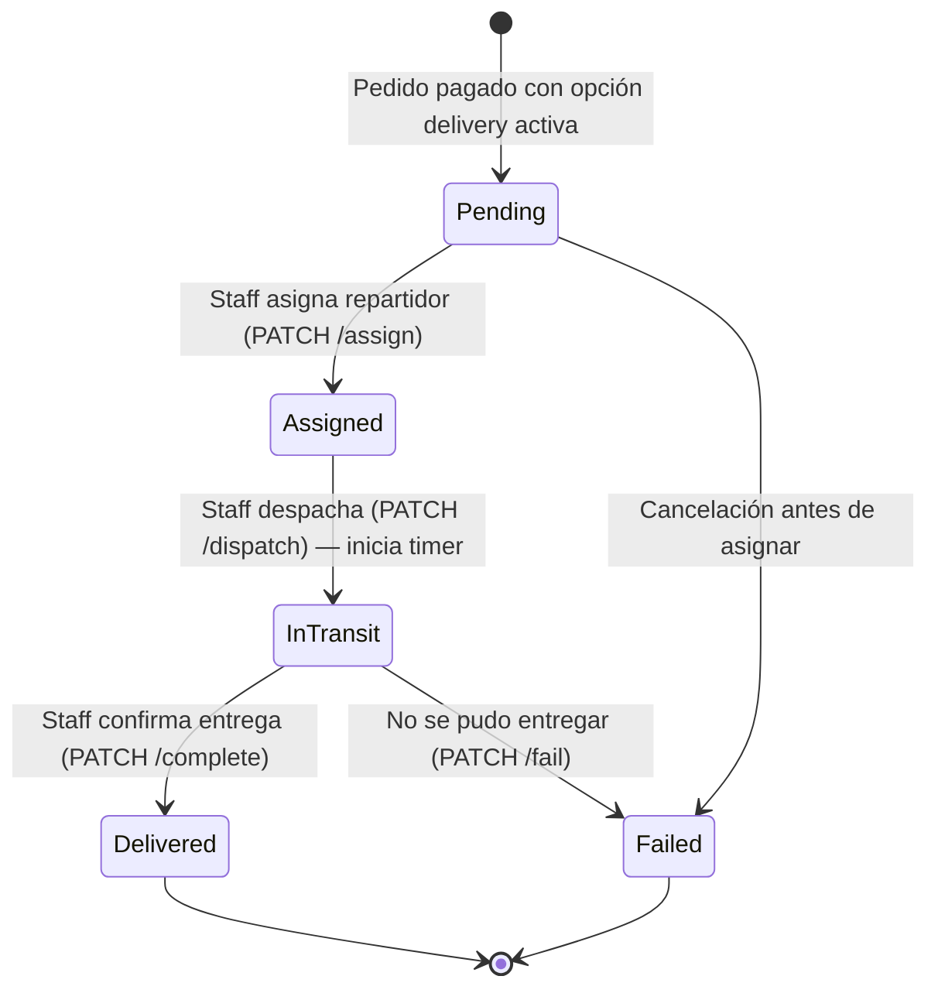
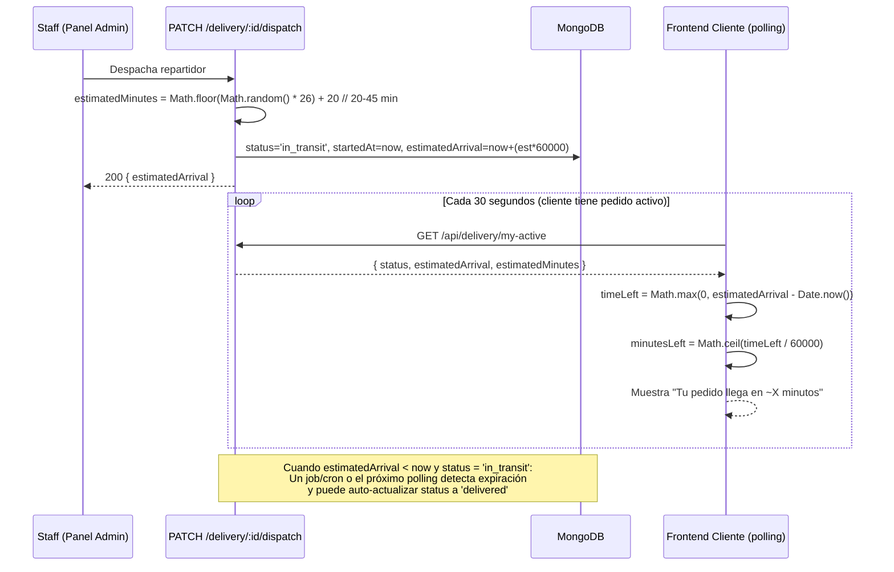
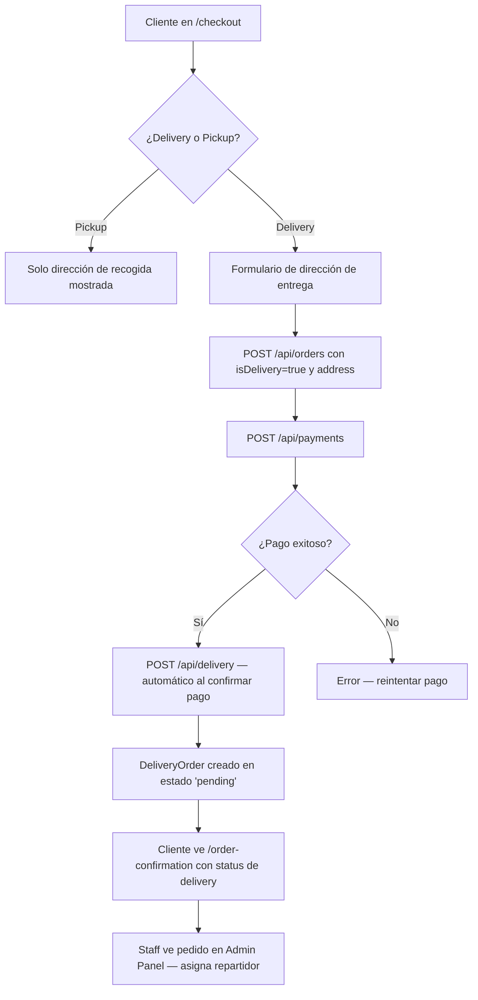

# EPIC-03 — Sistema de Delivery y Seguimiento

> Arancia incorpora servicio de entrega a domicilio como nuevo canal de negocio. Para el MVP, el seguimiento en vivo se simplifica deliberadamente: en lugar de un mapa GPS con trayectoria en tiempo real, el cliente ve **únicamente** una cuenta regresiva del tiempo estimado de llegada. El backend simula el progreso del repartidor de forma automática.

## Contexto de Negocio

> El delivery amplía el mercado potencial del restaurante significativamente más allá de la capacidad física del local. La decisión de "mostrar solo tiempo estimado" (sin mapa) es deliberada para el MVP: reduce la complejidad técnica en ~60% mientras mantiene la utilidad esencial para el cliente. El sistema de transporte tercero es la logística; la plataforma Arancia es la orquestación y la experiencia del cliente.
>
> **Decisión de diseño de UI confirmada**: No se mostrará ningún mapa ni trayectoria en vivo. Solo se mostrará el texto: *"Tu pedido llega en X minutos"* con un progreso visual basado en tiempo calculado.

## Descripción

**Como** cliente del restaurante,
**quiero** poder pedir a domicilio y ver cuánto tiempo falta para que llegue mi pedido,
**para** planificar mi tiempo sin necesidad de llamar al restaurante.

---

## Features Incluidas

| Feature | Descripción | Esfuerzo Est. |
|---|---|---|
| [FEAT-07](../features/FEAT-07_Delivery_Backend.md) | Modelo DeliveryOrder + API endpoints completos | Alta |
| [FEAT-08](../features/FEAT-08_Delivery_UI_Seguimiento.md) | UI cuenta regresiva de tiempo estimado | Media |

---

## Modelo de Datos Nuevo: `DeliveryOrder`

```typescript
{
  order: ObjectId,           // ref: 'Order' — 1:1 con el pedido
  user: ObjectId,            // ref: 'User'
  deliveryAddress: {
    street: String,          // Calle y número
    city: String,
    neighborhood?: String,   // Barrio o sector
    reference?: String,      // Ej: "portón verde, 2do piso"
    coordinates?: {          // Opcional — para v2 con mapa
      lat: Number,
      lng: Number
    }
  },
  status: 'pending' | 'assigned' | 'in_transit' | 'delivered' | 'failed',
  estimatedMinutes: Number,  // Calculado al despachar: randomInt(20, 45)
  startedAt?: Date,          // Timestamp cuando status → 'in_transit'
  estimatedArrival?: Date,   // = startedAt + estimatedMinutes * 60_000
  deliveredAt?: Date,        // Timestamp cuando status → 'delivered'
  deliveryAgent?: {
    name: String,
    phone: String
  },
  failReason?: String,       // Si status = 'failed'
  createdAt: Date,
  updatedAt: Date
}
```

---

## API Endpoints Nuevos

| Método | Ruta | Acceso | Descripción |
|---|---|---|---|
| `POST` | `/api/delivery` | Private (sistema interno) | Crea DeliveryOrder al confirmar pago con delivery |
| `GET` | `/api/delivery/my-active` | Private (customer) | Entrega activa del usuario (para cuenta regresiva) |
| `GET` | `/api/delivery/:id` | Private (customer/admin) | Detalle de entrega |
| `PATCH` | `/api/delivery/:id/assign` | Private (admin/staff) | Asigna repartidor |
| `PATCH` | `/api/delivery/:id/dispatch` | Private (admin/staff) | Despacha (inicia cuenta regresiva) |
| `PATCH` | `/api/delivery/:id/complete` | Private (admin/staff) | Marca como entregado |
| `GET` | `/api/admin/delivery` | Private (admin/staff) | Lista todas las entregas con filtros |

---

## Máquina de Estados del Delivery



---

## Lógica de Simulación del Tiempo Estimado



---

## Flujo de Checkout con Opción Delivery



---

## Integración con Checkout (EPIC-02)

Al completar un pago exitosamente:
1. Si `order.isDelivery === true`, el controlador de pagos llama automáticamente a `createDeliveryOrder(order._id)`.
2. La `DeliveryOrder` se crea en estado `pending` con la dirección de la Order.
3. El cliente ve en la pantalla de confirmación un mensaje: *"Tu pedido está siendo preparado. Te avisaremos cuando esté en camino."*

---

## UI de Seguimiento (Sin Mapa)

Componente `<DeliveryTracker />` en la página `/order-tracking/:orderId`:

```
┌─────────────────────────────────────────────────────┐
│  🛵 Tu pedido está en camino                        │
│                                                     │
│  ████████████░░░░░░░░  65% completado               │
│                                                     │
│  Tiempo estimado de llegada:                        │
│  ⏱  ~12 minutos                                    │
│                                                     │
│  Repartidor: Carlos M.  📞 +1 (809) XXX-XXXX       │
│                                                     │
│  Estado: En tránsito                               │
└─────────────────────────────────────────────────────┘
```

**NO hay mapa. NO hay trayectoria GPS.** Solo: tiempo restante, nombre del repartidor, y barra de progreso visual calculada desde `(estimatedMinutes - minutesLeft) / estimatedMinutes`.

---

## Criterios de Éxito de la Épica

- [ ] Al elegir delivery en checkout, `DeliveryOrder` se crea automáticamente al confirmar el pago
- [ ] Staff puede asignar repartidor y despachar desde el Admin Panel
- [ ] Al despachar, `estimatedArrival` se calcula con random(20-45 min) y se guarda en BD
- [ ] La página de seguimiento muestra la cuenta regresiva correctamente con polling de 30s
- [ ] La barra de progreso visual refleja el porcentaje de tiempo transcurrido
- [ ] Cuando `estimatedArrival` pasa, el sistema marca como `delivered`
- [ ] **Ningún mapa ni trayectoria GPS** en la UI — decisión de diseño firme para MVP
