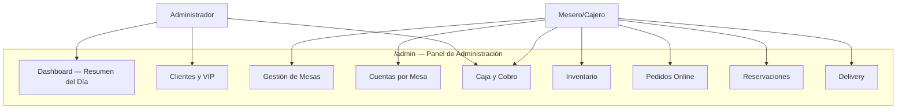

# EPIC-04 — Panel de Administración Interno

> El restaurante necesita herramientas digitales propias para gestionar su operación diaria: clientes y clientes VIP, mesas del salón, cuentas abiertas por mesa, caja y cobro, inventario de ingredientes/insumos, y la gestión de tours de pedidos y reservas. Este epic construye el panel de administración interno completo, accesible bajo la ruta `/admin` de la misma SPA.

## Contexto de Negocio

> Sin un panel de administración, el personal del restaurante no puede gestionar operaciones en tiempo real. Un cliente VIP no recibe su descuento. Una mesa ocupada no puede añadir otro plato a su cuenta. El cajero no puede cerrar su caja al final del día. Este epic es la diferencia entre una aplicación web de *vitrina* y una herramienta operacional real.
>
> **Decisión de arquitectura**: El panel admin es parte de la misma React SPA bajo rutas `/admin/*`. No es una aplicación separada. Esto permite compartir componentes, estado, y el mismo API client. El acceso está protegido por roles (`admin`, `staff`).

## Descripción

**Como** administrador o personal del restaurante,
**quiero** un panel de control interno que centralice la gestión de clientes, mesas, caja e inventario,
**para** operar el restaurante eficientemente desde una sola plataforma sin herramientas externas.

---

## Features Incluidas

| Feature | Descripción | Roles | Esfuerzo Est. |
|---|---|---|---|
| [FEAT-09](../features/FEAT-09_Admin_Auth_Layout.md) | Auth de admin + Layout base del panel | admin/staff | Media |
| [FEAT-10](../features/FEAT-10_Admin_Clientes_VIP.md) | Gestión de clientes + toggle VIP + descuentos | admin | Media |
| [FEAT-11](../features/FEAT-11_Admin_Mesas_y_Cuentas.md) | Gestión de mesas + cuentas abiertas por mesa | admin/staff | Alta |
| [FEAT-12](../features/FEAT-12_Admin_Caja_y_Cobro.md) | Apertura/cierre de caja + resumen diario | admin/staff | Alta |
| [FEAT-13](../features/FEAT-13_Admin_Inventario.md) | CRUD inventario + alertas de stock bajo | admin/staff | Media |

---

## Módulos del Panel Admin



---

## Nuevos Modelos de Datos

### `Table` Schema

```typescript
{
  number: Number,            // Número de mesa (1, 2, 3...)
  name?: String,             // Ej: "Mesa Terraza", "Mesa VIP 1"
  capacity: Number,          // Máximo de comensales
  section?: String,          // Ej: "Salón principal", "Terraza", "Bar"
  status: 'available' | 'occupied' | 'reserved' | 'maintenance',
  currentBill?: ObjectId,    // ref: 'TableBill' — cuenta actualmente abierta
  createdAt: Date,
  updatedAt: Date
}
```

### `TableBill` Schema

```typescript
{
  table: ObjectId,           // ref: 'Table'
  openedBy: ObjectId,        // ref: 'User' — staff que abrió la cuenta
  customer?: ObjectId,       // ref: 'User' — si el comensal está registrado
  customerName?: String,     // Si no está registrado: nombre manual
  isVip: Boolean,            // Aplica descuento VIP
  vipDiscount: Number,       // % de descuento aplicado (0-100)
  items: [{
    menuItem: ObjectId,      // ref: 'MenuItem'
    name: String,            // Snapshot del nombre al momento de agregar
    price: Number,           // Snapshot del precio al momento de agregar
    quantity: Number,
    notes?: String           // Ej: "sin cebolla"
  }],
  subtotal: Number,          // Calculado automáticamente
  discountAmount: Number,    // subtotal * vipDiscount / 100
  tax: Number,               // (subtotal - discountAmount) * 0.18
  total: Number,             // subtotal - discountAmount + tax
  status: 'open' | 'closed' | 'paid',
  payments: [{               // Historial de pagos de esta cuenta
    method: 'cash' | 'card' | 'transfer',
    amount: Number,
    receivedAt: Date,
    processedBy: ObjectId   // ref: 'User' — staff que cobró
  }],
  openedAt: Date,
  closedAt?: Date,
  paidAt?: Date,
  notes?: String
}
```

### `CashRegister` Schema

```typescript
{
  date: Date,                // Fecha del turno (solo la fecha, sin hora)
  openedBy: ObjectId,        // ref: 'User'
  closedBy?: ObjectId,       // ref: 'User'
  openingBalance: Number,    // Efectivo en caja al abrir
  closingBalance?: Number,   // Efectivo en caja al cerrar
  status: 'open' | 'closed',
  openedAt: Date,
  closedAt?: Date,
  summary?: {                // Calculado al cerrar
    totalCash: Number,
    totalCard: Number,
    totalTransfer: Number,
    totalSales: Number,
    totalOrders: Number,
    totalTableBills: Number
  }
}
```

### `InventoryItem` Schema

```typescript
{
  name: String,              // Ej: "Filete de res", "Aceite de oliva"
  category: String,          // Ej: "Carnes", "Lácteos", "Bebidas", "Condimentos"
  unit: String,              // Ej: "kg", "litros", "unidades", "porciones"
  currentStock: Number,
  minimumStock: Number,      // Umbral de alerta de stock bajo
  costPerUnit?: Number,      // Costo de adquisición (opcional, para análisis)
  supplier?: String,
  lastRestockedAt?: Date,
  lastRestockedBy?: ObjectId,// ref: 'User'
  isActive: Boolean,         // Para desactivar sin eliminar
  createdAt: Date,
  updatedAt: Date
}
```

---

## Ampliación del Modelo `User`

Agregar al schema `User` existente:

```typescript
// Nuevos campos en User
{
  role: 'customer' | 'staff' | 'admin',  // DEFAULT: 'customer'
  isVip: Boolean,                          // DEFAULT: false
  vipDiscount: Number,                     // % de descuento VIP (0-100); DEFAULT: 0
  vipSince?: Date,
  vipNotes?: String,                       // Notas internas sobre el cliente VIP
  totalOrders?: Number,                    // Contador de pedidos (para análisis)
  lastOrderAt?: Date
}
```

---

## API Endpoints Nuevos (Admin)

### Clientes y VIP

| Método | Ruta | Acceso |
|---|---|---|
| `GET` | `/api/admin/users` | admin |
| `GET` | `/api/admin/users/:id` | admin |
| `PUT` | `/api/admin/users/:id` | admin |
| `PATCH` | `/api/admin/users/:id/vip` | admin |
| `DELETE` | `/api/admin/users/:id` | admin |

### Mesas y Cuentas

| Método | Ruta | Acceso |
|---|---|---|
| `GET` | `/api/tables` | admin/staff |
| `POST` | `/api/tables` | admin |
| `PUT` | `/api/tables/:id` | admin |
| `DELETE` | `/api/tables/:id` | admin |
| `GET` | `/api/tables/:id/bill` | admin/staff |
| `POST` | `/api/tables/:id/bill` | admin/staff |
| `POST` | `/api/tables/:id/bill/items` | admin/staff |
| `DELETE` | `/api/tables/:id/bill/items/:itemId` | admin/staff |
| `POST` | `/api/tables/:id/bill/pay` | admin/staff |
| `POST` | `/api/tables/:id/bill/close` | admin/staff |

### Caja

| Método | Ruta | Acceso |
|---|---|---|
| `GET` | `/api/admin/cash-register/today` | admin/staff |
| `POST` | `/api/admin/cash-register/open` | admin/staff |
| `POST` | `/api/admin/cash-register/close` | admin/staff |
| `GET` | `/api/admin/cash-register/history` | admin |

### Inventario

| Método | Ruta | Acceso |
|---|---|---|
| `GET` | `/api/inventory` | admin/staff |
| `POST` | `/api/inventory` | admin |
| `PUT` | `/api/inventory/:id` | admin/staff |
| `PATCH` | `/api/inventory/:id/restock` | admin/staff |
| `DELETE` | `/api/inventory/:id` | admin |
| `GET` | `/api/inventory/alerts` | admin/staff |

---

## Layout del Panel Admin

```
/admin                     → Dashboard (resumen del día)
/admin/customers           → Lista y gestión de clientes
/admin/customers/:id       → Perfil detallado de cliente
/admin/tables              → Plano de mesas (vista de estado en tiempo real)
/admin/tables/:id/bill     → Cuenta activa de una mesa
/admin/cash-register       → Caja actual del día
/admin/inventory           → Lista de inventario
/admin/inventory/alerts    → Ítems con stock bajo
/admin/orders              → Pedidos online (todos)
/admin/reservations        → Reservaciones (todas)
/admin/delivery            → Entregas activas y pendientes
```

---

## Dashboard — Widgets de Resumen Diario

El Dashboard en `/admin` muestra:

| Widget | Fuente de Datos |
|---|---|
| 💰 Ventas del día | `CashRegister.summary.totalSales` |
| 🍽️ Mesas ocupadas / total | `Table.status` count |
| 📦 Pedidos online pendientes | `Order.status = 'pending'` count |
| 🛵 Deliveries en tránsito | `DeliveryOrder.status = 'in_transit'` count |
| ⚠️ Alertas de inventario | `InventoryItem.currentStock < minimumStock` count |
| 📅 Reservas de hoy | `Reservation.date = today` count |

---

## Criterios de Éxito de la Épica

- [ ] Rutas `/admin/*` redirigen a `/login` si el usuario no es `admin` o `staff`
- [ ] El dashboard muestra datos reales del día actual
- [ ] Admin puede ver, editar y marcar clientes como VIP con descuento configurable
- [ ] Staff puede abrir/cerrar cuentas por mesa y agregar ítems del menú a la cuenta
- [ ] La cuenta de una mesa calcula correctamente: subtotal → descuento VIP → IVA 18% → total
- [ ] Staff puede cobrar una cuenta por mesa (efectivo/tarjeta/transferencia)
- [ ] Admin puede abrir y cerrar la caja diaria con resumen de ventas
- [ ] Staff puede actualizar stock de inventario y ver alertas de stock bajo
- [ ] Descuento VIP del cliente se aplica automáticamente al abrir su cuenta por mesa
