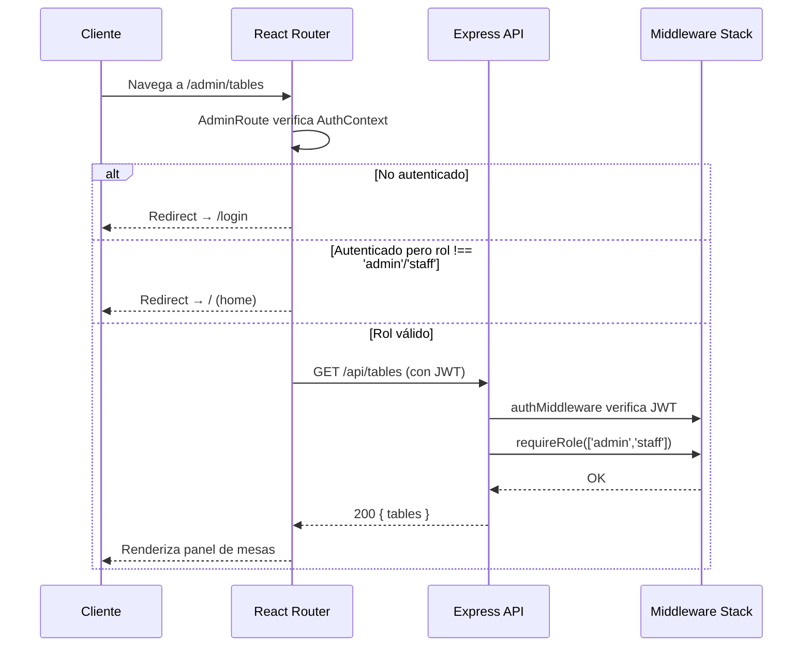

# EPIC-05 — Seguridad y Deuda Técnica

> Existen vulnerabilidades críticas identificadas en la base de código actual que deben ser resueltas antes o durante el desarrollo de las épicas nuevas. Este epic no agrega funcionalidad de negocio, pero es prerrequisito de seguridad para que el sistema sea desplegable en producción con responsabilidad.

## Contexto de Negocio

> Un sistema con una contraseña JWT hardcodeada por defecto, sin protección de rutas, sin rate limiting y sin roles de usuario no es un sistema listo para producción — es un sistema listo para ser comprometido. Esta épica resuelve la deuda técnica y sienta las bases de seguridad que todas las demás épicas requieren.

## Descripción

**Como** desarrollador responsable del sistema,
**quiero** eliminar todas las vulnerabilidades críticas identificadas y añadir las capas de seguridad faltantes,
**para** que el sistema pueda ser desplegado en producción sin exponer a los usuarios ni al negocio a riesgos evitables.

---

## Features Incluidas

| Feature | Descripción | Prioridad |
|---|---|---|
| [FEAT-04](../features/FEAT-04_Guards_Rutas_Privadas.md) | PrivateRoute + RoleRoute en React | Must Have |
| Roles en modelo `User` | Agregar campo `role` al schema existente | Must Have |
| Middleware `requireRole()` | Middleware Express de autorización por rol | Must Have |
| Remover `JWT_SECRET` default | Fail-fast si variable de entorno ausente | Must Have |
| Rate limiting en auth + pagos | `express-rate-limit` en endpoints críticos | Should Have |
| `helmet.js` en Express | Headers de seguridad HTTP | Should Have |
| Sanitización de inputs | `express-validator` en endpoints públicos | Should Have |
| `.env.example` documentado | Variables de entorno documentadas | Should Have |

---

## Deuda Técnica a Resolver

### DT-01: JWT_SECRET con Fallback Inseguro — CRÍTICO

**Problema actual en `backend/src/config/env.ts`:**
```typescript
// ❌ INSEGURO: si JWT_SECRET no está en .env, usa este valor
export const jwtSecret = process.env.JWT_SECRET || 'default-secret-key';
```

**Solución requerida:**
```typescript
// ✅ CORRECTO: el servidor no arranca si falta la variable
const jwtSecret = process.env.JWT_SECRET;
if (!jwtSecret) {
  console.error('FATAL: JWT_SECRET environment variable is not set');
  process.exit(1);
}
export { jwtSecret };
```

---

### DT-02: Sin Rate Limiting en `/auth/login` — ALTO

**Problema**: Endpoint completamente abierto a ataques de fuerza bruta.

**Solución**: Instalar `express-rate-limit` y aplicar:
```typescript
// Máximo 5 intentos de login por IP en 15 minutos
const loginRateLimiter = rateLimit({
  windowMs: 15 * 60 * 1000,
  max: 5,
  message: { success: false, message: 'Demasiados intentos. Intente en 15 minutos.' },
  standardHeaders: true,
  legacyHeaders: false,
});

router.post('/login', loginRateLimiter, authController.login);
```

También aplicar en `POST /api/payments` (máx. 3 por usuario/orden).

---

### DT-03: Sin PrivateRoute en el Frontend — ALTO

**Problema**: Cualquier usuario puede navegar a `/checkout`, `/profile`, `/my-reservations` sin autenticarse.

**Solución**: Componente `PrivateRoute` que lee `AuthContext`:
```typescript
// src/components/PrivateRoute.tsx
const PrivateRoute: React.FC<{ children: React.ReactNode }> = ({ children }) => {
  const { isAuthenticated, isLoading } = useAuth();
  if (isLoading) return <LoadingSpinner />;
  return isAuthenticated ? <>{children}</> : <Navigate to="/login" replace />;
};
```

Componente `AdminRoute` adicional que verifica rol:
```typescript
// src/components/AdminRoute.tsx
const AdminRoute: React.FC<{ roles: string[]; children: React.ReactNode }> = ({ roles, children }) => {
  const { user, isAuthenticated } = useAuth();
  if (!isAuthenticated) return <Navigate to="/login" replace />;
  if (!roles.includes(user?.role)) return <Navigate to="/" replace />;
  return <>{children}</>;
};
```

---

### DT-04: Sin Roles de Usuario — CRÍTICO para Admin Panel

**Problema**: El modelo `User` no tiene campo `role`. Sin roles, no es posible implementar el Admin Panel de forma segura.

**Solución**: Agregar al schema `User` existente:
```typescript
role: {
  type: String,
  enum: ['customer', 'staff', 'admin'],
  default: 'customer',
},
isVip: { type: Boolean, default: false },
vipDiscount: { type: Number, default: 0, min: 0, max: 100 },
```

**Middleware `requireRole` para Express:**
```typescript
export const requireRole = (roles: string[]) => (req, res, next) => {
  if (!req.user) return res.status(401).json({ success: false, message: 'No autenticado' });
  if (!roles.includes(req.user.role)) {
    return res.status(403).json({ success: false, message: 'Acceso no autorizado' });
  }
  next();
};
```

---

### DT-05: Sin Sanitización de Inputs — ALTO

**Problema**: Los endpoints públicos (`/contact`, `/reservations`, `/auth/register`) aceptan cualquier input sin sanitización, abriendo la puerta a XSS y NoSQL injection.

**Solución**: Usar `express-validator` (ya en el proyecto) en todos los endpoints públicos:
```typescript
// Ejemplo en reservation routes:
body('name').trim().escape().isLength({ min: 2, max: 100 }),
body('email').normalizeEmail().isEmail(),
body('notes').optional().trim().escape().isLength({ max: 500 }),
```

---

### DT-06: Carrito Anónimo No Migra al Hacer Login — MEDIA

**Problema**: Si un usuario agrega ítems al carrito sin autenticarse y luego hace login, los ítems en `localStorage` se pierden o no se fusionan con el carrito del servidor.

**Solución en `AuthContext.tsx`**: Al completar login exitosamente, leer el carrito de `localStorage`, y si tiene ítems, llamar `POST /api/cart` por cada uno para fusionarlos con el carrito del servidor.

---

## Checklist de Seguridad Pre-Producción

- [ ] `JWT_SECRET` sin fallback; servidor falla si ausente
- [ ] `express-rate-limit` en `/auth/login` (5 req/15min/IP) y `/payments` (3 req/orden/usuario)
- [ ] `helmet()` configurado en `server.ts`
- [ ] CORS con lista blanca explícita (no `'*'`)
- [ ] `PrivateRoute` aplicado a todas las rutas de usuario autenticado
- [ ] `AdminRoute` aplicado a todas las rutas `/admin/*`
- [ ] Middleware `requireRole` en todos los endpoints de admin
- [ ] Inputs sanitizados con `express-validator` en endpoints públicos
- [ ] `.env.example` presente con todas las variables documentadas
- [ ] Sin `console.log` con datos sensibles en producción
- [ ] `process.env.NODE_ENV === 'production'` desactiva stack traces en errores de API

---

## Flujo de Autorización Completo



---

## Criterios de Éxito de la Épica

- [ ] El servidor Express lanza excepción fatal si `JWT_SECRET` no está definido en `.env`
- [ ] `POST /api/auth/login` retorna 429 después de 5 intentos fallidos en 15 minutos
- [ ] Las rutas `/checkout`, `/profile`, `/my-reservations`, `/my-orders` redirigen a `/login` sin JWT
- [ ] Las rutas `/admin/*` redirigen a `/` si el usuario no tiene rol `admin` o `staff`
- [ ] Los endpoints de admin retornan 403 si el JWT no corresponde a un rol autorizado
- [ ] El carrito anónimo se fusiona correctamente con el del servidor al hacer login
- [ ] `helmet()` presente y activo en el servidor
- [ ] `.env.example` presente en raíz y en `/backend` con todas las variables
