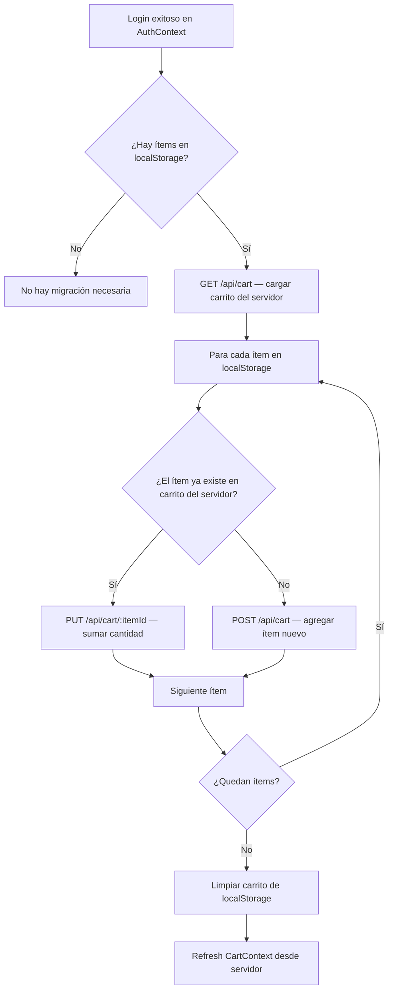

# FEAT-04 — Guards de Rutas Privadas y Migración de Carrito

**Épica:** [EPIC-01 — Completar MVP Core](../epicas/EPIC-01_Completar_MVP_Core.md) / [EPIC-05 — Seguridad](../epicas/EPIC-05_Seguridad_y_Deuda_Tecnica.md)

> Actualmente no hay ningún mecanismo de protección de rutas en el frontend. Cualquier usuario no autenticado puede navegar a `/checkout`, `/profile`, `/my-reservations` directamente desde la URL. Adicionalmente, hay un bug de UX: el carrito de un usuario anónimo (en `localStorage`) no se fusiona con el del servidor al autenticarse.

## Descripción

**Como** sistema de seguridad del frontend,
**quiero** que las rutas privadas requieran autenticación y que el carrito nunca se pierda al hacer login,
**para** proteger las páginas sensibles y garantizar una experiencia de compra fluida.

**Prioridad:** `Must Have`

---

## Componentes Nuevos a Crear

### `PrivateRoute.tsx`

```typescript
// src/components/PrivateRoute.tsx
// Redirige a /login si no está autenticado
// Muestra spinner mientras verifica el estado de autenticación
```

### `AdminRoute.tsx`

```typescript
// src/components/AdminRoute.tsx
// Redirige a /login si no está autenticado
// Redirige a / si está autenticado pero no tiene rol requerido
// Props: roles: ('admin' | 'staff')[]
```

---

## Rutas que Requieren Protección

| Ruta | Tipo de Guard | Roles Requeridos |
|---|---|---|
| `/checkout` | `PrivateRoute` | customer, staff, admin |
| `/profile` | `PrivateRoute` | customer, staff, admin |
| `/my-reservations` | `PrivateRoute` | customer, staff, admin |
| `/my-orders` | `PrivateRoute` | customer, staff, admin |
| `/admin` | `AdminRoute` | admin, staff |
| `/admin/*` | `AdminRoute` | admin, staff |

---

## Criterios de Aceptación

```
SCENARIO: Usuario no autenticado intenta acceder a /checkout
  Given el usuario no está autenticado (sin JWT en localStorage)
  When navega directamente a /checkout
  Then es redirigido a /login
  And después de hacer login exitosamente, regresa a /checkout

SCENARIO: Usuario autenticado puede acceder a /profile
  Given el usuario tiene JWT válido
  When navega a /profile
  Then la página se renderiza sin redirección

SCENARIO: AuthContext en estado 'loading' no redirige prematuramente
  Given el JWT está siendo validado con GET /api/auth/me
  When el estado isLoading = true
  Then la página muestra un spinner de carga
  And NO redirige a /login durante la carga

SCENARIO: Usuario con role='customer' intenta acceder a /admin
  Given el usuario está autenticado con role='customer'
  When navega a /admin
  Then es redirigido a / (home)
  And se muestra un toast "No tienes acceso a esta sección"

SCENARIO: Migración de carrito al hacer login
  Given un usuario anónimo agregó 2 ítems al carrito (en localStorage)
  When hace login exitosamente
  Then se detectan los ítems en localStorage
  And se llaman POST /api/cart para cada ítem del carrito local
  And los ítems aparecen en el carrito del servidor
  And el carrito local de localStorage se limpia

SCENARIO: Migración de carrito — ítem ya existe en carrito del servidor
  Given el servidor ya tiene el ítem A en el carrito del usuario
  When el localStorage también tiene el ítem A
  Then las cantidades se suman (no se duplican)
```

---

## Lógica de Migración del Carrito



---

## Task Breakdown

### Backend
- [ ] Verificar que el tipo `User` en `backend/src/types/index.ts` incluye el campo `role`
- [ ] Verificar que `GET /api/auth/me` retorna el campo `role` del usuario
- [ ] Agregar campo `role: 'customer' | 'staff' | 'admin'` al schema `User` si no existe
- [ ] Crear `backend/src/middleware/role.middleware.ts` con `requireRole(roles: string[])`

### Frontend (Componentes nuevos)
- [ ] Crear `src/components/PrivateRoute.tsx` que lee `isAuthenticated` e `isLoading` de `AuthContext`
- [ ] Si `isLoading`: renderizar `<div>Loading...</div>` o componente spinner (usar shadcn/ui `Skeleton`)
- [ ] Si `!isAuthenticated`: `<Navigate to="/login" state={{ from: location }} replace />`
- [ ] Crear `src/components/AdminRoute.tsx` que verifica adicionalmente `user.role`
- [ ] Envolver rutas protegidas en `App.tsx` con los componentes correspondientes

### Frontend (Cart Migration en AuthContext.tsx)
- [ ] En la función `login()` del `AuthContext`, después de guardar el token:
  - Leer `localStorage.getItem('guestCart')` (o el key actual del carrito anónimo)
  - Si hay ítems, iterar y llamar `cartApi.addItem()` por cada uno
  - Limpiar el carrito de localStorage post-migración
  - Llamar `CartContext.refreshCart()` para sincronizar

### Frontend (Redirect post-login)
- [ ] En `Login.tsx`: leer `location.state?.from` para redirigir al usuario a donde intentaba ir antes del redirect a `/login`

### Pruebas
- [ ] Verificar que `/checkout` sin JWT redirige a `/login`
- [ ] Verificar que post-login, el usuario regresa a la ruta que intentaba visitar
- [ ] Verificar que `/admin` con role='customer' redirige a `/`
- [ ] Verificar flujo completo de migración de carrito: agregar ítems anónimo → login → ítems en carrito del servidor
