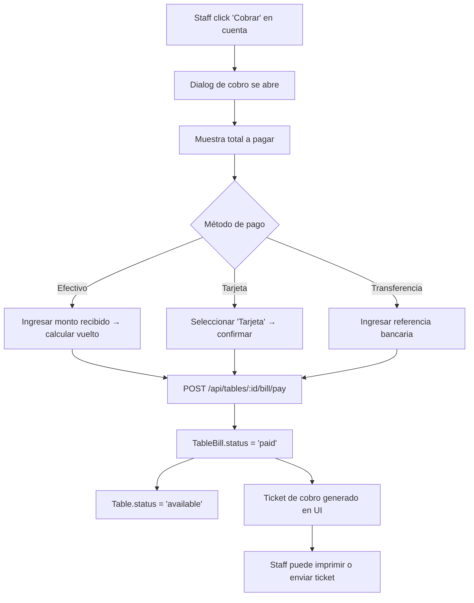

# FEAT-11 — Admin: Gestión de Mesas y Cuentas por Mesa

**Épica:** [EPIC-04 — Panel de Administración](../epicas/EPIC-04_Panel_Administracion.md)

> El corazón del restaurante presencial. El personal necesita ver el estado de todas las mesas en tiempo real, abrir cuentas, agregar platos a la cuenta de una mesa (incluyendo el menú digital), aplicar descuentos VIP, cobrar la cuenta y cerrarla.

## Descripción

**Como** mesero o cajero del restaurante,
**quiero** gestionar las mesas del salón y las cuentas de cada mesa,
**para** atender a los comensales presenciales de forma rápida y precisa.

**Prioridad:** `Must Have`

---

## Pantalla: Vista de Mesas (`/admin/tables`)

```
Mesas del Restaurante                    [ + Nueva Mesa ] [ ⚙ Gestionar ]

Salón Principal
┌──────────┐ ┌──────────┐ ┌──────────┐ ┌──────────┐
│  Mesa 1  │ │  Mesa 2  │ │  Mesa 3  │ │  Mesa 4  │
│  4 pers  │ │  2 pers  │ │  6 pers  │ │  4 pers  │
│          │ │          │ │          │ │          │
│ ✅ Libre │ │ 🔴 Ocup. │ │ 🔴 Ocup. │ │ ✅ Libre │
│          │ │ RD$1,250 │ │ RD$3,800 │ │          │
└──────────┘ └──────────┘ └──────────┘ └──────────┘

Terraza
┌──────────┐ ┌──────────┐
│  Mesa 5  │ │  Mesa 6  │
│  8 pers  │ │  4 pers  │
│          │ │          │
│ 📅 Res.  │ │ ✅ Libre │
└──────────┘ └──────────┘

Leyenda: ✅ Libre   🔴 Ocupada   📅 Reservada   🔧 Mantenimiento
```

---

## Pantalla: Cuenta Activa de Mesa (`/admin/tables/:id/bill`)

```
Mesa 2 — Cuenta Activa                    [ Cobrar ]  [ Cerrar ]

Cliente: Pedro García  ⭐ VIP (15% desc.)
Abierta hace: 45 min

ITEMS
────────────────────────────────────────────────────────
[ + Agregar Plato ]

  Lomo Saltado             x2    RD$ 1,190    [🗑]
  Agua mineral             x1    RD$    80    [🗑]
  Limonada especial        x1    RD$   150    [🗑]

────────────────────────────────────────────────────────
                        Subtotal:    RD$ 1,420
                 Descuento VIP 15%: -RD$   213
              IVA 18% (sobre 1,207):  RD$   217
                           TOTAL:    RD$ 1,424
────────────────────────────────────────────────────────

Notas de la mesa:
[Sin gluten en el lomo saltado, sin hielo en el agua]
```

---

## Modal: Agregar Plato a la Cuenta

```
┌──────────────────────────────────┐
│  Agregar Plato — Mesa 2          │
│                                  │
│  [ 🔍 Buscar en el menú... ]     │
│                                  │
│  Entradas                        │
│  ● Ceviche clásico    RD$ 450    │
│  ● Causa rellena      RD$ 380    │
│                                  │
│  Platos Principales              │
│  ● Lomo Saltado       RD$ 595    │
│  ● Pollo a la brasa   RD$ 480    │
│                                  │
│  Cantidad: [1]  [2]  [3]  [+]    │
│                                  │
│  Notas: [sin cebolla...]         │
│                                  │
│  [ Cancelar ]   [ Agregar ]      │
└──────────────────────────────────┘
```

---

## Flujo de Cobro de Mesa



---

## Cálculo del Total con VIP

```
Si el comensal es VIP:
  subtotal = suma de (price × quantity) de todos los items
  discountAmount = subtotal × (vipDiscount / 100)
  taxableAmount = subtotal - discountAmount
  tax = taxableAmount × 0.18
  total = taxableAmount + tax

Si NO es VIP:
  subtotal = suma de (price × quantity)
  discountAmount = 0
  tax = subtotal × 0.18
  total = subtotal + tax
```

Este cálculo ocurre en el backend (pre-save hook de `TableBill`), no en el frontend.

---

## Criterios de Aceptación

```
SCENARIO: Staff abre cuenta para una mesa
  Given Mesa 2 está en estado 'available'
  When staff hace click en Mesa 2 y luego "Abrir Cuenta"
  Then se crea TableBill con status='open'
  And Table 2 pasa a status='occupied'
  And la mesa muestra indicador rojo "Ocupada" en la vista de mesas

SCENARIO: Staff agrega plato a la cuenta
  Given Mesa 2 tiene cuenta abierta
  When staff abre el modal y selecciona "Lomo Saltado" x2 con nota "sin sal"
  And hace click en "Agregar"
  Then POST /api/tables/2/bill/items se llama
  And el ítem aparece en la cuenta con su precio
  And el subtotal y total se recalculan automáticamente

SCENARIO: Cuenta VIP aplica descuento automáticamente
  Given Mesa 3 tiene cuenta abierta con Pedro García (VIP 15%)
  When se agregan platos con subtotal = RD$ 1,000
  Then el total muestra:
    Subtotal: RD$ 1,000
    Descuento VIP (15%): -RD$ 150
    IVA 18%: RD$ 153
    Total: RD$ 1,003

SCENARIO: Staff cobra la cuenta en efectivo
  Given la cuenta de Mesa 2 tiene total = RD$ 1,424
  When staff selecciona "Efectivo", ingresa RD$ 1,500 recibidos
  Then el sistema muestra "Vuelto: RD$ 76"
  And POST /api/tables/:id/bill/pay se llama con method='cash', amount=1500
  And TableBill.status = 'paid'
  And Table.status = 'available'

SCENARIO: Staff elimina ítem de la cuenta antes de cobrar
  Given hay un ítem "Agua mineral x1" en la cuenta
  When staff hace click en el ícono de eliminar y confirma
  Then DELETE /api/tables/:id/bill/items/:itemId se llama
  And el total se recalcula sin ese ítem
```

---

## Task Breakdown

### Backend
- [ ] Crear `backend/src/models/Table.ts` con el schema definido
- [ ] Crear `backend/src/models/TableBill.ts` con cálculo automático en pre-save
- [ ] Implementar pre-save hook en `TableBill` para calcular `discountAmount`, `tax`, `total`
- [ ] Crear `backend/src/controllers/table.controller.ts` (getAll, create, updateStatus, delete)
- [ ] Crear `backend/src/controllers/tablebill.controller.ts` (openBill, addItem, removeItem, payBill, closeBill)
- [ ] Crear `backend/src/routes/table.routes.ts` con todos los endpoints
- [ ] Al pagar: atomic update de `TableBill.status='paid'` + `Table.status='available'` + `Table.currentBill=null`
- [ ] Seed de datos: crear 6 mesas de ejemplo en `menuSeed.ts` o nuevo `tableSeed.ts`

### Frontend
- [ ] Crear `src/pages/admin/Tables.tsx` con grid visual de mesas coloreadas por status
- [ ] Crear `src/pages/admin/TableBill.tsx` con lista de items + totales + botones de acción
- [ ] Crear `<AddItemModal />` con buscador del menú y campo de cantidad/notas
- [ ] Crear `<PaymentDialog />` para cobrar con 3 métodos; calcular vuelto si efectivo
- [ ] Agregar `tableApi` y `tableBillApi` en `api.ts`
- [ ] Las mesas muestran el total de la cuenta activa en su tarjeta si están ocupadas

### Pruebas
- [ ] Verificar que el cálculo VIP es correcto (15% del subtotal, no del total)
- [ ] Verificar que al cobrar la mesa, su estado cambia a 'available' en la vista
- [ ] Verificar que eliminar ítem recalcula el total correctamente
- [ ] Verificar que se puede pagar con efectivo, tarjeta y transferencia
