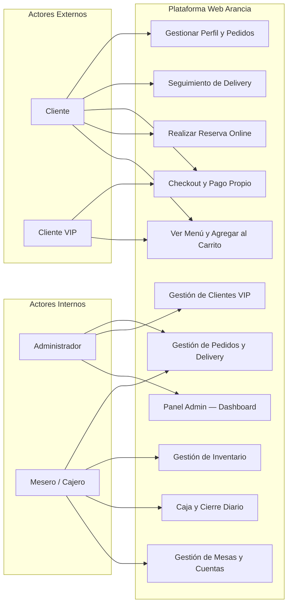
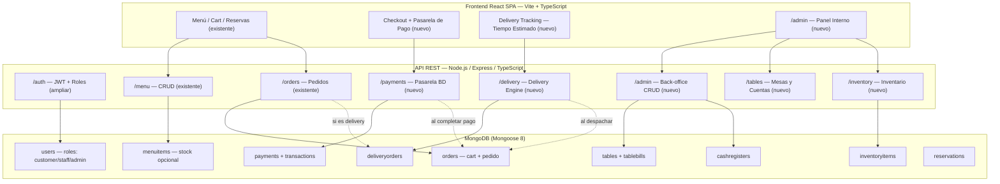

# 01 – Visión y Alcance: Arancia Restaurant Platform

## 1. Declaración de Visión

> "Brindar a Arancia una plataforma tecnológica 100% propia que digitalice toda la experiencia del comensal —desde la consulta del menú hasta el cobro y la entrega a domicilio— y que simultáneamente dote al equipo interno de herramientas de gestión operacional completas (mesas, caja, inventario y clientes VIP), todo sobre una arquitectura MERN escalable, sin dependencia de procesadores de pago externos."

## 2. Objetivos Estratégicos

| # | Objetivo | Indicador de Éxito |
|---|---|---|
| OBJ-1 | Completar el ciclo de compra end-to-end (menú → carrito → checkout → pago) | 0% páginas con datos mock en producción |
| OBJ-2 | Implementar pasarela de pago propia vía base de datos | Transacciones reales procesadas sin terceros |
| OBJ-3 | Ofrecer servicio de delivery con seguimiento de tiempo estimado | Cliente ve cuenta regresiva real del tiempo restante |
| OBJ-4 | Operar el restaurante desde un panel de admin propio | Staff puede gestionar mesas, caja e inventario sin sistemas externos |
| OBJ-5 | Mantener seguridad y calidad de código a nivel enterprise | Sin endpoints críticos sin autenticación; sin datos sensibles expuestos |

---

## 3. Stakeholders

| Stakeholder | Tipo | Interés Principal | Nivel de Influencia |
|---|---|---|---|
| Propietario del restaurante | Interno / Sponsor | ROI, control operacional, visibilidad de ingresos | Alto |
| Administradores del sistema | Interno / Admin | Gestión total del back-office | Alto |
| Personal de caja y meseros | Interno / Staff | Cobro rápido, estado de mesas, cuentas abiertas | Medio |
| Clientes finales | Externo / Customer | Pedir en línea, reservar, rastrear delivery | Alto |
| Clientes VIP | Externo / Premium | Descuentos, atención diferenciada y prioritaria | Medio |
| Repartidores | Externo / Delivery Agent | Recibir y ejecutar entregas asignadas | Bajo |
| Equipo de desarrollo | Técnico | Requisitos claros, arquitectura limpia y sin scope creep | Alto |

---

## 4. Diagnóstico del Estado Actual (Línea Base — Marzo 2026)

### 4.1 Completitud por Módulo

| Módulo | Frontend | Backend | Estado Global |
|---|---|---|---|
| Autenticación (Login/Register) | ✅ Integrado con `AuthContext` | ✅ JWT + bcrypt completo | **100% — Funcional** |
| Menú (lectura + búsqueda) | ✅ Integrado, filtra por categoría | ✅ CRUD completo + text search | **100% — Funcional** |
| Carrito (modo dual: anón/auth) | ✅ 80% — `CartContext` funcional | ✅ Cart como `Order status='cart'` | **80% — Falta migración anón→auth** |
| Contacto / Evento | ✅ Integrado | ✅ Guarda en MongoDB | **100% — Funcional** |
| Reservaciones | ⚠️ `setTimeout` mock, no llama API | ✅ CRUD completo en backend | **60% — Solo conectar FE** |
| Mis Reservaciones | ❌ Array hardcodeado, sin API | ✅ GET + cancel completos | **20% — Solo conectar FE** |
| Checkout / Crear Pedido | ⚠️ Datos "Juan Pérez" + `setTimeout` | ✅ `POST /orders` existe y funciona | **40% — Solo conectar FE** |
| Perfil de Usuario | ❌ "Juan Pérez" hardcodeado; `alert()` | ✅ GET/PUT profile completos | **20% — Solo conectar FE** |
| Historial de Pedidos | ❌ Página no existe | ✅ `GET /orders` funcional | **20% — Solo crear página FE** |
| Protección de rutas (Guards) | ❌ Inexistente — cualquier URL accesible | N/A | **0% — Deuda crítica** |
| Pasarela de Pago Propia | ❌ No existe | ❌ No existe | **0% — Nuevo** |
| Delivery con tracking | ❌ No existe | ❌ No existe | **0% — Nuevo** |
| Panel de Administración | ❌ No existe | ❌ No existe | **0% — Nuevo** |
| Gestión de Mesas | ❌ No existe | ❌ No existe | **0% — Nuevo** |
| Cuentas por Mesa | ❌ No existe | ❌ No existe | **0% — Nuevo** |
| Caja y Cobro Diario | ❌ No existe | ❌ No existe | **0% — Nuevo** |
| Inventario | ❌ No existe | ❌ No existe | **0% — Nuevo** |
| Gestión de Clientes VIP | ❌ No existe | ❌ No existe | **0% — Nuevo** |

### 4.2 Deuda Técnica Identificada

| ID | Deuda | Severidad |
|---|---|---|
| DT-01 | `JWT_SECRET` tiene fallback `'default-secret-key'` hardcodeado en `env.ts` | **CRÍTICA** |
| DT-02 | Sin rate limiting en `/auth/login` — vulnerable a brute force | **ALTA** |
| DT-03 | Sin `PrivateRoute` — `/checkout`, `/profile`, `/my-reservations` accesibles sin login | **ALTA** |
| DT-04 | Carrito anónimo no se fusiona con el del servidor al hacer login | **MEDIA** |
| DT-05 | Sin paginación en `GET /api/menu` — devuelve todos los items | **MEDIA** |
| DT-06 | Componentes duplicados heredados: `Header/ModernHeader`, `Footer/ModernFooter`, `Modal/ModernModal` | **BAJA** |
| DT-07 | Sin `.env.example` documentado — variables de entorno no documentadas | **BAJA** |
| DT-08 | Sin `helmet.js` — headers de seguridad HTTP no configurados | **MEDIA** |

---

## 5. Tabla MoSCoW — Priorización de Módulos del Sistema

### ✅ Must Have — Necesario para sistema productivo viable

| Módulo | Épica | Razón de Prioridad |
|---|---|---|
| Conectar Reservaciones FE con API real | EPIC-01 | Backend existe; es solo conectar |
| Conectar Checkout FE con API real | EPIC-01 | Flujo de negocio crítico; actualmente 100% mock |
| Completar Perfil de Usuario | EPIC-01 | Experiencia mínima del cliente autenticado |
| Crear página Mis Pedidos (`/my-orders`) | EPIC-01 | Trazabilidad mínima para el cliente |
| Protección de rutas con `PrivateRoute` | EPIC-05 | Seguridad básica inexcusable |
| Migración carrito anónimo → autenticado | EPIC-01 | Evita pérdida de carrito al hacer login |
| Modelos BD: `Payment` + `Transaction` | EPIC-02 | Base del sistema de cobro |
| API de Pago: crear, validar, completar, reintento | EPIC-02 | Sin esto, no hay monetización |
| Checkout integrado con pago real | EPIC-02 | Fin del flujo de compra |
| Roles de usuario: `customer` / `staff` / `admin` | EPIC-05 | Prerequisito de todo el Admin Panel |
| Middleware `requireRole()` en rutas protegidas | EPIC-05 | Prerequisito de todo el Admin Panel |
| Modelo BD: `DeliveryOrder` | EPIC-03 | Prerequisito del flujo de delivery |
| Flujo delivery: crear, asignar, despachar, simular | EPIC-03 | Nuevo servicio del restaurante |
| UI de tiempo estimado restante de delivery | EPIC-03 | Mínimo viable de seguimiento para el cliente |
| Panel Admin — Auth y Layout base (`/admin`) | EPIC-04 | Punto de entrada del panel |
| Panel Admin — Gestión de Clientes + VIP | EPIC-04 | Core operacional de fidelización |
| Panel Admin — Gestión de Mesas | EPIC-04 | Core operacional presencial |
| Panel Admin — Cuenta por Mesa | EPIC-04 | Core del cobro presencial |
| Panel Admin — Caja y Cobro Diario | EPIC-04 | Control financiero básico |
| Panel Admin — Inventario básico | EPIC-04 | Control operacional mínimo |

### 🟡 Should Have — Importante pero no bloqueante del MVP

| Módulo | Épica | Razón |
|---|---|---|
| Historial de pagos del cliente | EPIC-02 | Trazabilidad financiera para el usuario |
| Descuentos VIP aplicados en checkout | EPIC-04 | Monetizar la diferenciación de clientes |
| Dashboard estadístico básico en Admin | EPIC-04 | Visibilidad rápida del negocio |
| Notificaciones en-app (cambio de estado del pedido) | EPIC-03 | Mejor experiencia de usuario |
| Rate limiting en endpoints de autenticación | EPIC-05 | Seguridad básica contra ataques |
| Paginación en endpoints de listados | EPIC-05 | Performance con datos reales |
| Validación de stock en inventario al ordenar | EPIC-04 | Evitar overselling |

### 🔵 Could Have — Deseable si hay capacidad extra

| Módulo | Razón |
|---|---|
| Envío de emails transaccionales (confirmación reserva/pedido) | Comunicación proactiva con el cliente |
| Sistema de reseñas y calificaciones de platos | Social proof y feedback |
| Cupones y códigos de descuento | Promociones y campañas |
| Upload y gestión de imágenes desde Admin | Contenido dinámico del menú |
| Exportación de reportes PDF/CSV desde Admin | Reportería operacional |
| Refresh token automático (JWT silent refresh) | UX sin interrupciones de sesión |

### ❌ Won't Have — Fuera del alcance en esta iteración

| Módulo | Razón de Exclusión |
|---|---|
| Pasarela de terceros (Stripe, PayPal, Mercado Pago) | **Decisión de negocio firme**: sistema 100% propio |
| Tracking GPS en tiempo real con mapa (Leaflet/Mapbox) | MVP usa SOLO tiempo estimado; mapa en v2 |
| App móvil nativa (iOS/Android) | Fuera del alcance y presupuesto actual |
| Multi-tenancy (múltiples restaurantes) | Requiere arquitectura completamente diferente |
| Integración con POS externos | Complejidad operacional excesiva para MVP |
| Programa de puntos/fidelidad complejo | Requiere diseño dedicado |
| WebSockets para actualizaciones en tiempo real | Complejidad operacional; se usa polling simple |
| Facturación fiscal electrónica | Requiere integración con entes gubernamentales |
| CMS externo para gestión de contenido | Overkill para este alcance |

---

## 6. Casos de Uso de Alto Nivel

---

## 7. Arquitectura de Sistema — Vista de Contexto

---

## 8. Restricciones Técnicas y Decisiones Arquitectónicas

| Restricción | Detalle |
|---|---|
| **Stack fijo** | MERN (MongoDB + Express + React + Node) — no cambiar el stack base |
| **Sin procesadores de pago externos** | Toda la lógica de pago implementada en MongoDB + Express; sin SDK de terceros |
| **Sin WebSockets** | Para actualizaciones de delivery: polling HTTP simple (`setInterval`) o SSE |
| **Sin mapa en vivo** | El delivery muestra únicamente el tiempo estimado restante, no trayectoria en mapa |
| **MongoDB** | Mongoose 8 — continuar patrón de schemas existente; usar sessions para atomicidad |
| **TypeScript** | Obligatorio en frontend (React/Vite) y backend (Node/Express) |
| **Tailwind + shadcn/ui** | Todos los componentes nuevos usan el mismo sistema de diseño existente |
| **Rutas `/admin` protegidas** | Solo accesibles con roles `admin` o `staff`; redirecto a `/login` si no autorizado |
| **Panel Admin** | Parte de la misma SPA React bajo ruta `/admin/*`; no aplicación separada |
