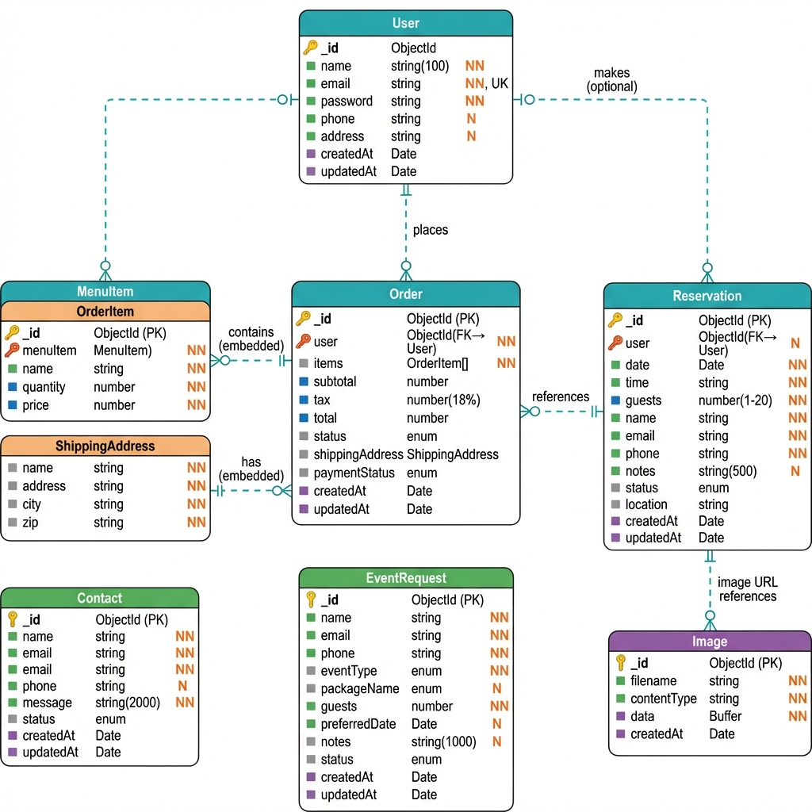

# Documento de Visión del Proyecto

## Arancia — Plataforma Digital de Restaurante

---

## Información del Documento

| Propiedad   | Valor         |
| ----------- | ------------- |
| Versión     | 1.0           |
| Fecha       | 22/01/2026    |
| Estado      | Borrador      |
| Responsable | Product Owner |

## Historial de Revisiones

| Fecha      | Versión | Descripción                    | Autor         |
| ---------- | ------- | ------------------------------ | ------------- |
| 22/01/2026 | 1.0     | Creación inicial del documento | Product Owner |

---

## Tabla de Contenidos

- ✓ 1. Introducción
- ✓ 2. Posicionamiento
- ✓ 3. Interesados y Usuarios
- ✓ 4. Descripción General del Producto
- ✓ 5. Funcionalidades del Producto
- ✓ 6. Restricciones
- ✓ 7. Prioridad y Fases
- ✓ 8. Otros Requisitos
- ✓ 9. Requisitos de Documentación

---

## 1. Introducción

**Arancia** es un restaurante de reciente creación ubicado en República Dominicana. Desde su concepción, incorpora una plataforma web como parte central de su operación, con el objetivo de diferenciarse de los demás restaurantes de la zona que no cuentan con herramientas digitales propias.

Este documento define el problema que se busca resolver, los objetivos del proyecto, el alcance de la solución y las funcionalidades que debe incluir la plataforma. Sirve como referencia para todas las partes involucradas en el desarrollo.

El contenido se basa en un estudio del mercado gastronómico local, la identificación de carencias en los servicios digitales de restaurantes de la zona, y las capacidades del equipo de desarrollo.

### 1.1 Propósito

Este documento define qué se va a construir, por qué y para quién. Su función es que todas las partes involucradas tengan una comprensión común del proyecto antes y durante el desarrollo.

**Audiencia principal:**

- Responsables del producto y gestión del proyecto
- Equipo de desarrollo (interfaz de usuario y servidor)
- Fundadores del restaurante Arancia
- Equipo de pruebas, diseño y documentación

### 1.2 Alcance

El proyecto comprende el diseño, desarrollo y puesta en marcha de una plataforma web para el restaurante Arancia. La plataforma permite a los clientes consultar el menú, realizar pedidos en línea, reservar mesas y solicitar cotizaciones para eventos privados.

**Áreas Afectadas:**

- Comensales y clientes del restaurante (usuarios finales)
- Personal de cocina y servicio (gestión de pedidos y reservaciones)
- Área administrativa y gerencia (reportes y métricas)
- Equipo de eventos (coordinación de eventos privados y paquetes)
- Soporte técnico y mantenimiento de la plataforma

**Problemas que Resuelve:**

1. Los restaurantes de la zona no cuentan con sistemas de pedidos en línea y dependen de procesos manuales con errores frecuentes
2. No existe disponibilidad visible de mesas para reservar en línea en los restaurantes locales
3. Los restaurantes de la competencia no ofrecen un catálogo digital de su menú con precios, ingredientes e imágenes
4. La coordinación de eventos privados y cotizaciones se realiza de forma desorganizada en el sector
5. No hay un canal digital directo entre los restaurantes de la zona y sus clientes

**✅ INCLUIDO en el Alcance:**

- Página de inicio con presentación del restaurante y servicios destacados
- Menú digital con búsqueda por nombre o ingredientes y filtrado por categorías
- Carrito de compras con cálculo automático de subtotal, impuestos (ITBIS 18%) y total
- Sistema de pedidos en línea con dirección de envío
- Sistema de reservaciones en línea (fecha, hora, número de comensales, notas)
- Confirmación y gestión de reservaciones por parte del usuario
- Módulo de eventos privados con paquetes (Esencial RD$2,500 / Premium RD$5,000 / Elite RD$10,000)
- Formulario de contacto y solicitud de cotización de eventos
- Galería de imágenes del restaurante
- Página "Acerca de" con visión, misión y valores del restaurante
- Página de servicios ofrecidos
- Registro e inicio de sesión de usuarios
- Perfil de usuario con edición de datos personales y cambio de contraseña
- Servidor de datos con 8 módulos (autenticación, usuarios, menú, reservaciones, carrito, pedidos, contacto, imágenes)
- Diseño adaptable a computadoras y dispositivos móviles

**❌ NO INCLUIDO (Fuera del Alcance):**

- Pagos en línea con tarjeta
- Panel de administración interno para el personal del restaurante
- Aplicaciones móviles para iOS o Android
- Rastreo de entregas en tiempo real
- Programa de puntos o recompensas
- Conexión con plataformas de delivery externas (Uber Eats, PedidosYa, etc.)
- Módulos de análisis de datos avanzado

### 1.3 Objetivos

Los objetivos del proyecto están definidos de forma clara y medible dentro de los plazos establecidos.

**Objetivos de Negocio:**

1. **Digitalización del Menú y Pedidos**
   - Meta: Establecer el sistema de menú digital y carrito de compras en línea como canal principal de pedidos desde la apertura del restaurante
   - Métrica: Porcentaje de pedidos realizados a través de la plataforma vs. pedidos manuales
   - Fecha límite: Q3 2026

2. **Optimización de Reservaciones**
   - Meta: Lograr que el 80% de las reservaciones se realicen a través de la plataforma web desde el lanzamiento, estableciendo el canal digital como vía principal
   - Métrica: Porcentaje de reservaciones online vs. otros canales
   - Fecha límite: Q4 2026

3. **Captación de Eventos desde el Lanzamiento**
   - Meta: Captar al menos 10 solicitudes de cotización de eventos privados mensuales mediante la visibilidad de los paquetes (Esencial, Premium, Elite) en la plataforma desde el primer mes de operación
   - Métrica: Número de solicitudes de eventos recibidas mensualmente a través del sistema
   - Fecha límite: Q3 2026

**Objetivos Técnicos:**

1. **Disponibilidad del Sistema**
   - Meta: Que la plataforma esté disponible el 99.5% del tiempo
   - Métrica: Seguimiento continuo del estado del sistema

2. **Velocidad de Respuesta**
   - Meta: Que cualquier acción del usuario en la plataforma responda en menos de 2 segundos
   - Métrica: Tiempo de respuesta promedio del servidor

3. **Seguridad y Protección de Datos**
   - Meta: Proteger el acceso de usuarios y sus contraseñas con métodos seguros de la industria
   - Métrica: Revisiones de seguridad cada tres meses sin problemas graves

### 1.4 Definiciones y Abreviaciones

| Término       | Definición                                                                                 |
| ------------- | ------------------------------------------------------------------------------------------ |
| ITBIS         | Impuesto a las Transferencias de Bienes Industrializados y Servicios (18% en RD)           |
| RD$           | Pesos Dominicanos, moneda oficial de República Dominicana                                  |
| Interfaz      | La parte del sistema que el usuario ve y con la que interactúa (las páginas web)           |
| Servidor      | La parte del sistema que procesa los datos y la lógica del negocio (no visible al usuario) |
| Base de datos | Donde se almacena toda la información del sistema (usuarios, menú, pedidos, etc.)          |
| Sprint        | Período de trabajo de 2 semanas donde se desarrollan funcionalidades específicas           |

---

## 2. Posicionamiento

### 2.1 Oportunidad de Negocio

La mayoría de los restaurantes en República Dominicana operan sin herramientas digitales propias. Los pedidos se toman de forma manual, las reservaciones se gestionan por teléfono y no existe un canal directo en línea entre el restaurante y sus clientes. Arancia se funda con una plataforma web propia desde el primer día de operación, lo que lo posiciona de forma distinta en el mercado local.

Las plataformas de entrega de terceros cobran comisiones elevadas y no representan la imagen del restaurante. Con una plataforma propia, Arancia opera sin depender de intermediarios y controla directamente la relación con sus clientes.

La inversión se justifica por los siguientes factores: independencia de comisiones a terceros, operación digital desde la apertura, gestión ordenada de reservaciones y captación de eventos privados mediante los paquetes ofrecidos (Esencial, Premium, Elite).

**Beneficios Esperados:**

- **Operación eficiente:** Pedidos y cálculo de impuestos (ITBIS 18%) de forma automática desde el primer día, sin depender de procesos manuales
- **Mejor experiencia para el cliente:** Menú con imágenes, búsqueda por ingredientes y filtrado por categorías disponible en línea
- **Reservaciones ordenadas:** Sistema que muestra la disponibilidad real y evita errores de reservas duplicadas (1-20 comensales por reserva)
- **Captación de eventos:** Paquetes de eventos privados (20-150 personas) visibles en la plataforma con solicitud de cotización incluida
- **Presencia en línea:** Sitio web propio que presenta al restaurante y lo diferencia de la competencia local

**Retorno de Inversión Proyectado:**

| Concepto               | Detalle                                                                                                    |
| ---------------------- | ---------------------------------------------------------------------------------------------------------- |
| Inversión Total        | Según alcance final del proyecto y herramientas seleccionadas                                              |
| Retorno Esperado       | Sin comisiones a terceros, captación directa de clientes en línea, posicionamiento diferenciado en la zona |
| Tiempo de Recuperación | 12-18 meses según proyecciones conservadoras                                                               |

### 2.2 Sentencia del Problema

| Aspecto              | Descripción                                                                                                                                                                                                                                                                                                                                                |
| -------------------- | ---------------------------------------------------------------------------------------------------------------------------------------------------------------------------------------------------------------------------------------------------------------------------------------------------------------------------------------------------------- |
| **El Problema**      | Los restaurantes de la zona dependen de métodos manuales y llamadas telefónicas para tomar pedidos, gestionar reservaciones y coordinar eventos. Esto genera errores, pérdida de clientes y oportunidades desaprovechadas. Arancia necesita una plataforma digital desde su apertura para no caer en los mismos problemas.                                 |
| **Afecta a**         | Clientes de la zona que no tienen forma de reservar mesas o hacer pedidos en línea. El equipo de Arancia, que necesita herramientas digitales para operar de forma ordenada. Los fundadores, que requieren información sobre la operación y las preferencias de los clientes desde el inicio.                                                              |
| **Impacto Negativo** | Sin la plataforma, Arancia operaría igual que los demás restaurantes de la zona: con procesos manuales, errores en reservaciones, baja captación de eventos y sin datos para tomar decisiones sobre el menú y la operación.                                                                                                                                |
| **Solución Exitosa** | Una plataforma web que desde la apertura del restaurante permita a los clientes ver el menú con imágenes e ingredientes, agregar platillos al carrito con cálculo automático de ITBIS, reservar mesas seleccionando fecha, hora y comensales, solicitar cotizaciones de eventos privados (Esencial/Premium/Elite) y contactar al restaurante directamente. |

### 2.3 Sentencia de Posición del Producto

| Elemento                           | Descripción                                                                                                                                                               |
| ---------------------------------- | ------------------------------------------------------------------------------------------------------------------------------------------------------------------------- |
| **Para:**                          | Clientes y organizadores de eventos que buscan un restaurante con servicios digitales en República Dominicana                                                             |
| **Que tienen la necesidad de:**    | Consultar el menú, hacer pedidos en línea, reservar mesas y solicitar cotizaciones de eventos de forma rápida y confiable                                                 |
| **La Plataforma Digital Arancia:** | Es una aplicación web de página única                                                                                                                                     |
| **Que ofrece:**                    | Menú digital, carrito de compras con cálculo automático de impuestos, reservaciones en línea, paquetes de eventos privados y contacto directo con el restaurante          |
| **A diferencia de:**               | Restaurantes que dependen de procesos manuales y telefónicos, y plataformas de entrega de terceros que cobran comisiones altas y no representan la imagen del restaurante |
| **Nuestro producto:**              | Fue construido desde el inicio para Arancia y se adapta a las necesidades reales de sus clientes                                                                          |

---

## 3. Descripción de Interesados y Usuarios

### 3.1 Resumen de Interesados

| Interesado                 | Rol                       | Interés                                                                | Influencia |
| -------------------------- | ------------------------- | ---------------------------------------------------------------------- | ---------- |
| Fundadores del Restaurante | Patrocinador              | Retorno de inversión, construcción de imagen del restaurante           | Alta       |
| Responsable de Producto    | Dueño de producto         | Éxito del producto, satisfacción de los clientes                       | Alta       |
| Líder Técnico              | Líder de desarrollo       | Calidad de la solución y decisiones de construcción                    | Alta       |
| Gerente del Restaurante    | Líder operativo           | Que el personal use la plataforma, operación ordenada desde el inicio  | Media-Alta |
| Chef Ejecutivo             | Responsable de menú       | Que los platillos, ingredientes y categorías se muestren correctamente | Media      |
| Coordinador de Eventos     | Líder de eventos          | Recepción ordenada de solicitudes de eventos y paquetes                | Media      |
| Equipo Técnico             | Soporte e infraestructura | Funcionamiento continuo del sistema                                    | Media      |
| Clientes                   | Usuarios finales          | Facilidad de uso, rapidez en pedidos y reservaciones                   | Media      |

### 3.2 Resumen de Usuarios

| Perfil de Usuario         | Descripción                                                                     | Necesidades                                                                           | Experiencia         |
| ------------------------- | ------------------------------------------------------------------------------- | ------------------------------------------------------------------------------------- | ------------------- |
| Cliente General           | Persona que visita el sitio para ver el menú, hacer pedidos y reservar mesas    | Diseño fácil de usar, menú con imágenes e ingredientes, pedido rápido                 | Básica              |
| Organizador de Eventos    | Persona que busca contratar servicios de eventos privados (bodas, corporativos) | Ver paquetes (Esencial/Premium/Elite), solicitar cotización, contactar al restaurante | Básica - Intermedia |
| Usuario con Cuenta        | Cliente registrado en la plataforma                                             | Perfil editable, historial de pedidos, ver sus reservaciones                          | Intermedia          |
| Administrador del Sistema | Personal técnico que gestiona la plataforma                                     | Gestión de menú, usuarios, pedidos y reservaciones                                    | Avanzada            |

### 3.3 Entorno de Usuario

```
Contexto de Uso:
├─ Ubicación: Acceso desde cualquier lugar con conexión a internet
├─ Dispositivos: Computadoras y teléfonos móviles
├─ Disponibilidad: 24/7 para consulta de menú y reservaciones
├─ Navegadores: Chrome, Firefox, Edge (versiones recientes)
└─ Moneda: Pesos Dominicanos (RD$)
```

---

## 4. Descripción General del Producto

### 4.1 Perspectiva del Producto

- ☑ Producto Independiente con capacidad de integración
- ☐ Parte de una familia de productos
- ☑ Componente que se integra con sistemas existentes

**Descripción:**

La plataforma de Arancia es una aplicación web que opera de forma independiente. Está compuesta por dos partes: la interfaz que ve el usuario (construida con React 18, Vite y TailwindCSS) y el servidor que procesa los datos (construido con Express.js, TypeScript y MongoDB). Es el canal digital principal del restaurante.

El servidor está organizado en 8 módulos (autenticación, usuarios, menú, reservaciones, carrito, pedidos, contacto, imágenes), lo que permite agregar funcionalidades en el futuro sin afectar las existentes.

**Funciones de Integración:**

- Sistema propio de registro e inicio de sesión con contraseñas protegidas
- Almacenamiento de imágenes directamente en la base de datos
- Comunicación documentada entre la interfaz y el servidor
- Configuración separada por ambiente (desarrollo, pruebas, producción)

**Componentes Técnicos del Sistema:**

| Componente       | Tecnología                   | Descripción                                  |
| ---------------- | ---------------------------- | -------------------------------------------- |
| Interfaz         | React 18 + TypeScript + Vite | 15 páginas y más de 60 elementos de interfaz |
| Estilos          | TailwindCSS 4 + Radix UI     | Diseño visual accesible y profesional        |
| Animaciones      | Motion (Framer Motion)       | Transiciones y movimientos en la interfaz    |
| Servidor         | Express.js + TypeScript      | 8 módulos de datos y lógica de negocio       |
| Base de Datos    | MongoDB + Mongoose           | 7 colecciones de datos con validaciones      |
| Inicio de sesión | JWT + bcryptjs               | Acceso seguro y contraseñas protegidas       |
| Validación       | express-validator            | Verificación de datos antes de guardarlos    |
| Gráficos         | Recharts                     | Visualización de datos y métricas            |

**Diagrama Entidad-Relación (ER) del Sistema:**



### 4.2 Suposiciones y Dependencias

**Supuestos:**

- Los clientes del restaurante tienen acceso a internet y a un navegador web actualizado
- El restaurante cuenta con personal para atender los pedidos y reservaciones que llegan por la plataforma
- El menú se carga en la base de datos desde el inicio y se mantendrá actualizado mediante un panel administrativo futuro
- Los precios están en Pesos Dominicanos (RD$) con ITBIS del 18%
- Los involucrados en el proyecto estarán disponibles para revisiones cada 2 semanas
- El servidor contratado soportará la cantidad esperada de usuarios

**Dependencias Externas:**

| Dependencia           | Descripción                                                         | Criticidad | Estado                                  | Responsable         |
| --------------------- | ------------------------------------------------------------------- | ---------- | --------------------------------------- | ------------------- |
| Base de datos         | Almacenamiento de usuarios, menú, pedidos y reservaciones (MongoDB) | Crítica    | Disponible                              | Equipo Técnico      |
| Servidor de hospedaje | Donde se ejecutan la interfaz y el servidor del sistema             | Crítica    | Por definir                             | Equipo Técnico      |
| Imágenes de Platillos | Fotografías profesionales de los platillos del menú                 | Alta       | En proceso (usando imágenes temporales) | Equipo de Marketing |
| Diseño de Interfaz    | Diseño visual de todas las pantallas de la plataforma               | Alta       | Completado                              | Equipo de Diseño    |
| Dominio y Certificado | Dirección web del restaurante y certificado de seguridad            | Alta       | Pendiente                               | Equipo Técnico      |

### 4.3 Costo y Precio

| Concepto          | Detalles                                                                                                    |
| ----------------- | ----------------------------------------------------------------------------------------------------------- |
| Inversión Inicial | Desarrollo de la interfaz, servidor, base de datos y diseño visual                                          |
| Costos Operativos | Servidor de hospedaje, base de datos y mantenimiento continuo                                               |
| Ahorros Esperados | Sin comisiones a plataformas de entrega de terceros, operación digital desde el inicio sin costos de cambio |
| Retorno Esperado  | Retorno positivo proyectado en 12-18 meses después de la apertura del restaurante                           |

---

## 5. Funcionalidades del Producto

### Funcionalidades Principales

| #   | Funcionalidad           | Descripción                                                                                                                                     | Beneficio                                | Prioridad |
| --- | ----------------------- | ----------------------------------------------------------------------------------------------------------------------------------------------- | ---------------------------------------- | --------- |
| 1   | Menú Digital            | Catálogo de platillos con imágenes, precios (RD$), ingredientes, búsqueda y filtrado por categorías                                             | El cliente ve el menú completo en línea  | Alta      |
| 2   | Carrito de Compras      | Agregar y quitar platillos, actualizar cantidades, cálculo automático de subtotal, ITBIS (18%) y total                                          | Pedido rápido y sin errores de cálculo   | Alta      |
| 3   | Pedidos en Línea        | Proceso completo de pedido con dirección de envío, confirmación y seguimiento de estados                                                        | Ventas digitales con seguimiento         | Alta      |
| 4   | Registro y Perfiles     | Registro, inicio de sesión, perfil editable y cambio de contraseña                                                                              | Seguridad y datos personalizados         | Alta      |
| 5   | Reservaciones en Línea  | Formulario con fecha, hora, número de comensales (1-20), notas opcionales y estados de la reservación                                           | Gestión ordenada de mesas                | Alta      |
| 6   | Mis Reservaciones       | Sección del usuario para ver el historial, estado y cancelar reservaciones activas                                                              | El cliente gestiona sus propias reservas | Alta      |
| 7   | Eventos Privados        | Tipos de eventos (Social, Corporativo, Privado) y paquetes (Esencial RD$2,500 / Premium RD$5,000 / Elite RD$10,000) con solicitud de cotización | Captación de eventos y ventas            | Media     |
| 8   | Formulario de Contacto  | Envío de mensajes con nombre, correo, teléfono y mensaje                                                                                        | Comunicación directa con los clientes    | Media     |
| 9   | Galería del Restaurante | Imágenes del restaurante, ambientes y platillos                                                                                                 | Presentación visual del restaurante      | Media     |
| 10  | Gestión de Imágenes     | Almacenamiento de imágenes directamente en la base de datos del sistema                                                                         | Sin dependencia de servicios externos    | Baja      |

### Lista de Funcionalidades:

- ☐ Menú digital con búsqueda y filtros por categoría
- ☐ Carrito de compras con cálculo de ITBIS
- ☐ Pedidos en línea con proceso completo
- ☐ Registro, inicio de sesión y perfiles de usuario
- ☐ Reservaciones en línea (1-20 comensales)
- ☐ Gestión de reservaciones del usuario
- ☐ Eventos privados con paquetes
- ☐ Formulario de contacto y cotización de eventos
- ☐ Galería de imágenes
- ☐ Almacenamiento de imágenes en la base de datos

---

## 6. Restricciones

Las siguientes restricciones deben respetarse durante todo el proyecto.

### Limitaciones del Proyecto

| Tipo        | Restricción                                                 | Impacto | Justificación                                      |
| ----------- | ----------------------------------------------------------- | ------- | -------------------------------------------------- |
| Tecnológica | Interfaz: React 18 + TypeScript + Vite + TailwindCSS 4      | Alto    | Herramientas definidas por el equipo de desarrollo |
| Tecnológica | Servidor: Express.js + TypeScript + MongoDB/Mongoose        | Alto    | Herramientas definidas por el equipo de desarrollo |
| Tecnológica | Inicio de sesión: JWT + bcryptjs                            | Alto    | Seguridad del acceso de los usuarios               |
| Normativa   | Cálculo correcto del ITBIS (18%) en todos los pedidos       | Crítico | Cumplimiento fiscal de República Dominicana        |
| Normativa   | Protección de datos personales de los clientes              | Crítico | Cumplimiento de la ley de protección de datos      |
| Presupuesto | Inversión limitada al presupuesto aprobado                  | Alto    | Restricción financiera del proyecto                |
| Tiempo      | Lanzamiento de la primera versión en el plazo acordado      | Alto    | Coordinación con la apertura del restaurante       |
| Recursos    | Equipo de desarrollo de 3-5 personas                        | Medio   | Disponibilidad actual del equipo                   |
| Diseño      | Funcionar correctamente en computadoras y teléfonos móviles | Medio   | Accesibilidad desde cualquier dispositivo          |
| Moneda      | Todos los precios en Pesos Dominicanos (RD$)                | Alto    | Mercado objetivo: República Dominicana             |

### Restricciones Identificadas

- ☐ Herramientas de desarrollo definidas (React + Express + MongoDB)
- ☐ Cálculo de ITBIS 18% implementado correctamente
- ☐ Límites de presupuesto claros
- ☐ Fechas de entrega establecidas
- ☐ Tamaño del equipo documentado

---

## 7. Prioridad y Fases de Desarrollo

### Primera Versión del Producto

#### Fase 1 — CRÍTICA (v1.0 - Primera versión)

| Funcionalidad                                     | Estado      | Responsable        | Fecha Estimada |
| ------------------------------------------------- | ----------- | ------------------ | -------------- |
| ☐ Página de inicio con presentación y servicios   | Por iniciar | Equipo de Interfaz | Sprint 1-2     |
| ☐ Menú digital con búsqueda, filtros y categorías | Por iniciar | Equipo Completo    | Sprint 2-3     |
| ☐ Registro e inicio de sesión de usuarios         | Por iniciar | Equipo de Servidor | Sprint 1-2     |
| ☐ Carrito de compras con cálculo de ITBIS         | Por iniciar | Equipo Completo    | Sprint 3-4     |
| ☐ Proceso de pedido completo                      | Por iniciar | Equipo Completo    | Sprint 4-5     |
| ☐ Reservaciones en línea                          | Por iniciar | Equipo Completo    | Sprint 3-5     |
| ☐ Servidor de datos completo (8 módulos)          | Por iniciar | Equipo de Servidor | Sprint 1-5     |

#### Fase 2 — IMPORTANTE (v1.1)

- ☐ Eventos privados con paquetes (Esencial/Premium/Elite)
- ☐ Formulario de contacto y solicitud de cotización de eventos
- ☐ Galería del restaurante
- ☐ Página "Acerca de" con visión y misión de Arancia
- ☐ Página de servicios
- ☐ Perfil de usuario con edición de datos y cambio de contraseña

#### Fase 3 — DESEABLE (v1.2+)

- ☐ Panel de administración para gestión del restaurante
- ☐ Pagos en línea con tarjeta de crédito o débito
- ☐ Notificaciones por correo electrónico (confirmación de pedidos y reservaciones)
- ☐ Panel de datos y estadísticas para la gerencia
- ☐ Aplicación móvil
- ☐ Rastreo de entregas en tiempo real
- ☐ Programa de puntos y recompensas
- ☐ Conexión con herramientas de análisis de datos

### Matriz de Priorización

| Funcionalidad               | Valor | Esfuerzo | Prioridad |
| --------------------------- | ----- | -------- | --------- |
| Menú digital                | Alto  | Medio    | 1         |
| Registro e inicio de sesión | Alto  | Medio    | 2         |
| Carrito de compras + ITBIS  | Alto  | Medio    | 3         |
| Reservaciones en línea      | Alto  | Medio    | 4         |
| Proceso de pedido completo  | Alto  | Alto     | 5         |
| Servidor de datos           | Alto  | Alto     | 6         |
| Eventos y paquetes          | Medio | Medio    | 7         |
| Contacto y cotizaciones     | Medio | Bajo     | 8         |
| Galería                     | Medio | Bajo     | 9         |
| Panel de administración     | Alto  | Alto     | 10        |

---

## 8. Otros Requisitos del Producto

### Requisitos Adicionales

| Categoría      | Requisito                                  | Métrica                                                 | Estado |
| -------------- | ------------------------------------------ | ------------------------------------------------------- | ------ |
| Velocidad      | Tiempo de respuesta del servidor           | Menos de 2 segundos en el 95% de los casos              | ☐      |
| Velocidad      | Tiempo de carga inicial de la página       | Menos de 3 segundos                                     | ☐      |
| Seguridad      | Datos protegidos durante la transmisión    | Conexión segura HTTPS                                   | ☐      |
| Seguridad      | Contraseñas protegidas                     | Método de protección bcrypt                             | ☐      |
| Seguridad      | Control de acceso a funciones protegidas   | Verificación de identidad del usuario en cada solicitud | ☐      |
| Facilidad      | Funcionamiento en navegadores principales  | Chrome, Firefox, Edge (últimas 2 versiones)             | ☐      |
| Facilidad      | Adaptable a distintos tamaños de pantalla  | Computadora (1920x1080), teléfono móvil y tableta       | ☐      |
| Facilidad      | Idioma de la interfaz                      | 100% en español                                         | ☐      |
| Disponibilidad | Tiempo en línea del sistema                | 99.5% mensual                                           | ☐      |
| Disponibilidad | Tiempo fuera de servicio por mantenimiento | Menos de 4 horas al mes                                 | ☐      |
| Crecimiento    | Usuarios al mismo tiempo                   | 100-500 usuarios simultáneos                            | ☐      |
| Crecimiento    | Almacenamiento de datos a futuro           | Capacidad para 3 años de información                    | ☐      |
| Mantenimiento  | Pruebas automáticas                        | Más del 70% del código principal cubierto con pruebas   | ☐      |
| Mantenimiento  | Documentación                              | Documentación del servidor y de la base de datos        | ☐      |

### Requisitos de Calidad y Pruebas

```
┌─ Pruebas
│  ├─ ☐ Pruebas por componente (>80% de cobertura en lógica principal)
│  ├─ ☐ Pruebas de funcionamiento completo (servidor de datos)
│  └─ ☐ Pruebas de carga (100-500 usuarios al mismo tiempo)
├─ Documentación
│  ├─ ☐ Documentación del servidor de datos
│  ├─ ☐ Estructura de la base de datos (diagrama disponible)
│  └─ ☐ Código documentado con tipos de datos explícitos
└─ Soporte
   ├─ ☐ Acuerdo de nivel de servicio definido
   └─ ☐ Sección de preguntas frecuentes
```

---

## 9. Requisitos de Documentación

### Documentos a Entregar

| Documento                           | Descripción                                                                        | Responsable             | Estado                 |
| ----------------------------------- | ---------------------------------------------------------------------------------- | ----------------------- | ---------------------- |
| Manual de Usuario                   | Guía para clientes: cómo usar el menú, hacer pedidos, reservar y solicitar eventos | Redactor Técnico        | ☐                      |
| Manual de Administrador             | Guía para administradores: gestión de menú, pedidos, reservaciones y usuarios      | Redactor Técnico        | ☐                      |
| Documentación del Sistema           | Estructura del sistema, decisiones de diseño y herramientas utilizadas             | Líder Técnico           | ☐                      |
| Referencia del Servidor de Datos    | Descripción completa de los 8 módulos del servidor                                 | Equipo de Servidor      | ☐                      |
| Estructura de Base de Datos         | Diagrama de las 7 colecciones de datos con sus relaciones                          | Equipo de Servidor      | ☑ (database_schema.md) |
| Guía de Instalación                 | Instrucciones para poner en marcha el sistema en un servidor                       | Equipo de Operaciones   | ☐                      |
| Guía de Conexión con Otros Sistemas | Cómo conectar sistemas externos con el servidor de datos de Arancia                | Equipo de Servidor      | ☐                      |
| Plan de Capacitación                | Programa de entrenamiento para el personal del restaurante                         | Responsable de Producto | ☐                      |
| Preguntas Frecuentes                | Preguntas comunes y solución de problemas                                          | Equipo de Soporte       | ☐                      |

### Checklist de Documentación

- ☐ Guías de usuario (clientes y administradores)
- ☐ Material de capacitación para el personal del restaurante
- ☑ Estructura de la base de datos (database_schema.md)
- ☐ Documentación del servidor de datos
- ☐ Procedimientos de soporte
- ☐ Notas de cada versión publicada
- ☐ Políticas de privacidad y términos de uso

---

## Aprobaciones

| Rol                        | Nombre      | Firma    | Fecha     |
| -------------------------- | ----------- | -------- | --------- |
| Responsable de Producto    | Por asignar | \_\_\_\_ | Pendiente |
| Fundadores del Restaurante | Por asignar | \_\_\_\_ | Pendiente |
| Líder Técnico              | Por asignar | \_\_\_\_ | Pendiente |
| Gerente del Restaurante    | Por asignar | \_\_\_\_ | Pendiente |

---

## Información de Contacto

- **Responsable de Producto:** productowner@bobtoronja.com
- **Líder Técnico:** techlead@bobtoronja.com
- **Gerente de Proyecto:** pm@bobtoronja.com
- **Restaurante:** Arancia — República Dominicana

---

> **Documento Confidencial:** Este documento contiene información privada del proyecto. Su distribución está restringida al equipo del proyecto y personas autorizadas. Prohibida su reproducción total o parcial sin autorización.

> © 2026 Arancia — Todos los derechos reservados
