# Esquema de Módulos del Proyecto

Este documento representa la arquitectura modular del proyecto `Restaurant01`.

```mermaid
graph TB
    %% Estilos
    classDef page fill:#e1f5fe,stroke:#01579b,stroke-width:2px;
    classDef component fill:#f3e5f5,stroke:#4a148c,stroke-width:2px;
    classDef context fill:#fff3e0,stroke:#e65100,stroke-width:2px;
    classDef service fill:#e8f5e9,stroke:#1b5e20,stroke-width:2px;
    classDef core fill:#eceff1,stroke:#263238,stroke-width:2px;

    subgraph Client ["Cliente (React Application)"]
        direction TB

        subgraph Core_Layer ["Core & Routing"]
            App["App.tsx"]:::core
            Main["main.tsx"]:::core
            Router["React Router"]:::core
        end

        subgraph Presentation_Layer ["Capa de Presentación (Páginas)"]
            direction TB
            Home["Home"]:::page
            Menu["Menu"]:::page
            Reservations["Reservations"]:::page
            Contact["Contact"]:::page
            Events["Events"]:::page
            Services["Services"]:::page
            Gallery["Gallery"]:::page
            About["About"]:::page
            
            subgraph User_Pages ["Usuario"]
                Login["Login"]:::page
                Profile["Profile"]:::page
                MyReservations["MyReservations"]:::page
            end

            subgraph Shop_Pages ["E-commerce"]
                Cart["Cart"]:::page
                Checkout["Checkout"]:::page
                BookingConfirmation["BookingConfirmation"]:::page
            end

            NotFound["NotFound"]:::page
        end

        subgraph Component_Layer ["Capa de Componentes"]
            direction TB
            subgraph Layout ["Layout"]
                Header["Header / ModernHeader"]:::component
                Footer["Footer / ModernFooter"]:::component
                Sidebar["Sidebar / MobileSidebar"]:::component
                Nav["TopNav / BottomNav"]:::component
            end
            
            subgraph Common ["Comunes / UI"]
                Modal["Modal"]:::component
                UI_Lib["UI Components (Button, Input, etc.)"]:::component
            end
        end

        subgraph State_Layer ["Gestión de Estado (Contexts)"]
            AuthCtx["Auth Context"]:::context
            CartCtx["Cart Context"]:::context
        end

        subgraph Service_Layer ["Capa de Servicios (API Integration)"]
            AuthSvc["Auth Service"]:::service
            UserSvc["User Service"]:::service
            MenuSvc["Menu Service"]:::service
            ResSvc["Reservation Service"]:::service
            CartSvc["Cart Service"]:::service
            OrderSvc["Order Service"]:::service
            ContactSvc["Contact Service"]:::service
        end
    end

    subgraph Backend ["Backend API"]
        API_Endpoints[("REST Endpoints")]
    end

    %% Relaciones Principales
    
    %% Core flow
    Main --> App
    App --> State_Layer
    App --> Router
    Router --> Presentation_Layer

    %% Navegación y Layout
    App --> Layout
    Layout --> Nav
    Presentation_Layer -.-> Layout

    %% Dependencias de Páginas
    Presentation_Layer --> Common
    Presentation_Layer --> State_Layer
    Presentation_Layer --> Service_Layer

    %% Dependencias de Componentes
    Layout --> State_Layer
    Common --> State_Layer

    %% Flujos Específicos (Ejemplos)
    Login --> AuthCtx
    AuthCtx --> AuthSvc
    Profile --> UserSvc
    
    Menu --> CartCtx
    Cart --> CartCtx
    CartCtx --> CartSvc
    
    Reservations --> ResSvc
    Checkout --> OrderSvc

    %% Conexión con Backend
    Service_Layer <--> API_Endpoints
```

## Descripción de Módulos

### 1. Core & Routing
Punto de entrada de la aplicación. Configura los proveedores de contexto globales y define las rutas de navegación principales.

### 2. Capa de Presentación (Páginas)
Contiene las vistas principales de la aplicación. Se dividen en:
- **Públicas**: Home, Menu, Contacto, etc.
- **Usuario**: Login, Perfil, Mis Reservas.
- **E-commerce**: Carrito, Checkout, Confirmación.

### 3. Capa de Componentes
Elementos reutilizables de la interfaz.
- **Layout**: Estructura base (encabezados, pies de página, navegación lateral).
- **UI/Comunes**: Elementos visuales atómicos (botones, modales, inputs).

### 4. Gestión de Estado (Context)
Maneja el estado global de la aplicación.
- **AuthContext**: Gestiona la sesión del usuario, login, registro y token.
- **CartContext**: Gestiona el carrito de compras, adición de items y cálculo de totales.

### 5. Capa de Servicios
Encapsula la lógica de comunicación con el Backend. Centraliza las llamadas [fetch](file:///c:/Users/pagar/OneDrive/Documentos/Projects/Restaurant01/src/services/api.ts#83-115) y maneja tokens de autenticación [src/services/api.ts](file:///c:/Users/pagar/OneDrive/Documentos/Projects/Restaurant01/src/services/api.ts).
